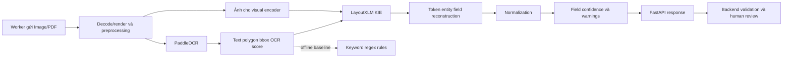

# 1. Project Understanding

## Mục tiêu và cơ sở lập kế hoạch

MEMBER A triển khai AI cho hệ thống Intelligent Document Processing: nhận ảnh/PDF receipt, OCR, trích xuất company/address/date/total, chuẩn hóa và trả confidence để Backend validation và human review. MVP dùng **PaddleOCR + LayoutXLM fine-tuned** và có baseline PaddleOCR + keyword/regex/rule. Kế hoạch này chỉ thiết kế, không chứa code triển khai.

Nguồn chính là `Invoice_IDP_Pipeline_v1_huong-ban-dau_+_phan-mo-rong.docx`, đã đọc toàn bộ mục 0–13, phần mở rộng A–D, các bảng, header/footer và comment. Không dùng các DOCX tên gần giống để thay thế. Ký hiệu **D§** chỉ mục trong DOCX; **DA.n/DC** chỉ phần mở rộng; **Cmt** chỉ comment. Yêu cầu người dùng trong file văn bản đi kèm quyết định phạm vi đầu ra và chọn LayoutXLM. Comment trong DOCX là góp ý cần phân tích, không tự động thành nhiệm vụ mới. DOCX gốc không bị sửa.

**Nguồn yêu cầu khác với quyết định thiết kế:** các giới hạn, hyperparameter, seed, schema và acceptance criteria chưa có trong DOCX được ghi là **đề xuất**. Những nội dung phụ thuộc bản dataset, GPU hoặc thỏa thuận Backend được ghi **cần xác minh**. Chưa có kết quả huấn luyện, benchmark hay kiểm thử hệ thống thực tế.

Hệ thống tổng thể: Upload → storage → queue → worker → AI → lưu extraction → validation → REVIEW_REQUIRED → người dùng edit/approve/reject → kết quả và audit. Lỗi xử lý được Backend retry, sau giới hạn chuyển FAILED. AI không quyết định APPROVED/REJECTED, không ghi DB nghiệp vụ, không tự tạo queue. Theo D§3, confidence cao vẫn đi qua human review trong MVP.

## Kết quả cần bàn giao của A

Dataset manifest/split cố định; OCR cache và CER/WER; baseline; LayoutXLM checkpoint có thể tái lập; field metrics và phân tích lỗi; inference bundle; FastAPI contract/service; test và tài liệu tích hợp. Thành công khoa học là so sánh trung thực trên cùng protocol, không cam kết trước LayoutXLM chắc chắn thắng baseline.

# 2. Member A Scope

| Hạng mục | Trách nhiệm A | Căn cứ và ranh giới |
|---|---|---|
| MC-OCR 2021, SROIE | Inspection, thống kê, fixed split, loader, mapping, processed data | D§6, §9; QA label cùng B trong Week 1–2 |
| Preprocessing, PaddleOCR | Chuẩn bị ảnh, OCR adapter, text/polygon/bbox/confidence, CER/WER | D§2.2, §9, §12.1; không train OCR từ đầu |
| Rule baseline | Company/address/date/total từ OCR, đánh giá đối chứng | D§2.2, §9 |
| LayoutXLM | Conversion, alignment, fine-tune, chọn checkpoint, inference/reconstruction | Người dùng yêu cầu; mâu thuẫn tên ở D§2.2 được giữ trong mục 4 |
| Normalization/confidence | Raw/normalized, date/VND, warnings, field score, threshold cơ bản | D§2.2, §9, §12.2 |
| Evaluation | OCR/KIE riêng, field P/R/F1/EM, attribution, GT-OCR diagnostic nếu khả thi | D§12.1 |
| FastAPI | Inference, request validation phía AI, error contract, logs, health/readiness | D§4, §9, §11 |
| Shared | API contract, QA label, integration, Compose phần AI, E2E, deployment, report/demo | D§9; A cung cấp AI artifacts, cùng B xác nhận giao tiếp |
| Wild collection sớm | Cùng B thu thập ảnh, lưu provenance; chưa train/evaluate | D§9, DA.5; labeling/evaluation sau MVP |

**B sở hữu:** Spring Boot, PostgreSQL/Flyway, MinIO/S3, upload công khai, RabbitMQ/worker, state machine/retry/idempotency, persistence, validation nghiệp vụ, review/edit/approve/reject, audit, toàn bộ frontend/dashboard. A hỗ trợ fixtures, lỗi AI, semantics confidence và latency. Không giao A viết Review UI chỉ vì Week 5 ghi như vậy.

Ngoài scope: line items, nhiều loại chứng từ, tích hợp ERP cụ thể, fraud/signature/tax authority, Kubernetes, train OCR foundation, production multilingual. CORD/FUNSD chỉ tham khảo; không lập nhánh train bắt buộc. Khảo sát thị trường trong Cmt thuộc thảo luận báo cáo chung, không phải module AI hay task implementation mới.

# 3. MVP vs Extension

| MVP phải có | Sau MVP | Chuẩn bị sớm không chặn MVP |
|---|---|---|
| MC-OCR train/val/test, OCR CER/WER, rule baseline, LayoutXLM, 4 fields | A.1 ensemble theo field | Interface extractor và output chung |
| PaddleOCR cố định | A.2 VietOCR vs PaddleOCR | Lưu OCR cache, thông tin crop và phiên bản |
| Một model KIE chính | A.3 LiLT + PhoBERT | Version hóa tokenizer/label map/processed data |
| Score field và threshold cơ bản trên validation; báo cáo điểm threshold cố định | A.4 đường cong sâu từ operational logs, calibration nếu cần | Giữ confidence, model version, liên kết corrections phía B |
| Evaluation MC-OCR và kế hoạch benchmark SROIE | A.5 wild labeling/evaluation | Thu thập ảnh cùng B từ Week 1–2 |

SROIE là benchmark đối chứng thuộc trách nhiệm A, không đổi tên thành extension A.1–A.5. Tuy nhiên D§1.3 cho phép chạy nếu còn thời gian trong khi D§9 giao chuẩn bị cả hai. Quyết định kế hoạch: chuẩn bị loader/protocol SROIE sớm; dành Week 6–7 cho evaluation sau khi MC-OCR chạy được; nếu thiếu dữ liệu/GT, ghi `NOT_RUN` và lý do, không tuyên bố đã hoàn thành benchmark. Không để retrain SROIE trì hoãn MVP MC-OCR.

MVP gate: inference thật end-to-end, raw/normalized/confidence/warnings đúng contract, OCR và KIE metrics trên test đóng băng, baseline so sánh cùng split, lỗi/timeout tích hợp được, bundle chạy lại được. Extension không là dependency của bất kỳ gate này. Augmentation nhẹ là đề xuất huấn luyện theo Cmt/DA.5, được thử trong MVP nếu pipeline bbox đã đúng; nghiên cứu augmentation sâu để sau.

# 4. Pipeline Inconsistencies / Open Questions

| ID và vị trí | Inconsistency hoặc thiếu rõ ràng | Ảnh hưởng | Recommendation và người chốt |
|---|---|---|---|
| Q01 — bìa, D§1–7, §9–13 vs DA.1/DA.3 và Cmt | Phần chính dùng LayoutLMv3; DA.3 nói giữ LayoutXLM; DA.1 dùng cả hai tên | Sai checkpoint, stack, contract và báo cáo | Kế hoạch dùng LayoutXLM theo yêu cầu người dùng; A/B thống nhất cập nhật tài liệu ở công việc riêng, không sửa gốc tại đây |
| Q02 — D§9 vs Week 5 | WBS giao A AI, B frontend; Week 5 giao A Review UI | Mất thời gian train/evaluation | A làm warnings/error analysis/integration; B làm UI; timeline mục 22 là đề xuất điều chỉnh công khai |
| Q03 — D§9 và Week 6 | Week 6 nhiều task software, không ghi AI owner; Week 8–12 nói A hỗ trợ | Dễ biến thời gian trống thành frontend | A dùng Week 6 kiểm thử AI, threshold, SROIE; B giữ software |
| Q04 — D§1.3/§6/§9 | SROIE vừa được giao vừa có điều kiện thời gian | Tiêu chí nghiệm thu khác nhau | A/B chốt chế độ benchmark ở T02; phân biệt prepared, executed, deferred |
| Q05 — D§0/§2 | 4–6 fields nhưng chỉ định nghĩa rõ 4 | Thiếu labels/metrics/schema cho field 5–6 | Freeze 4 field; thêm field là thay đổi scope có mapping/GT riêng |
| Q06 — D§6.5 | Nói GT có sẵn, chưa chỉ file, alignment và coverage | Có thể không đủ supervision line/token hoặc OCR toàn trang | T01/T04 kiểm tra thực tải; không đo OCR toàn trang bằng chuỗi 4 field |
| Q07 — D§6.1–6.2 | SROIE nêu 600/400; bản phân phối có thể khác | Báo cáo sai N/split | Lấy số từ manifest thực, giữ official split của bản dùng; không ép N từ overview |
| Q08 — D§3.4 vs §8/§11 | Output dictionary `value` khác envelope `fields`; thiếu raw/normalized/warning/version | B không persist/map nhất quán | Contract đề xuất mục 19; freeze trước service, Shared T03 |
| Q09 — D§2.2 và Cmt confidence | Flow đặt confidence sau normalization, Cmt hỏi confidence từ KIE | Trộn score model với độ đúng sau parse | Thu OCR/KIE scores tại nguồn; aggregate sau reconstruction; normalization tạo trạng thái/warning, không tự tăng xác suất |
| Q10 — D§3/§12.2 vs DA.4 | MVP mọi tài liệu review; extension mô tả tỷ lệ tự approve | Review-rate thực tế và mô phỏng bị nhập nhằng | MVP actual review=100% extraction thành công; threshold chỉ ưu tiên/cảnh báo; auto-pass curve là giả lập offline, không bật auto-approve |
| Q11 — D§4 và Cmt worker | Worker service riêng hay consumer Spring Boot chưa chốt | Ownership lấy object, timeout, connection chưa rõ | B quyết topology; A chỉ HTTP contract và correlation IDs |
| Q12 — D§2/§3 | Nhận PDF nhưng không nói multipage, limits, rendering | Có thể bỏ trang hoặc timeout vô hạn | Đề xuất MVP 1 page/receipt, reject PDF nhiều trang có lỗi rõ; Shared chốt trước T09/T22 |
| Q13 — D§7 | Python 3.11+ nhưng chưa pin môi trường LayoutXLM/Paddle/Torch/GPU | Native dependencies có thể không tương thích | T05 dựng và smoke test trên rented GPU environment dùng cho training; pin CUDA/dependencies/checksums; nếu cần Python khác ghi deviation, không đổi model ngầm |
| Q14 — D§10 Week 3–4 | Conversion+fine-tune tuần 3, evaluation+API tuần 4 phụ thuộc GT/runtime chưa kiểm chứng | Timeline lạc quan | Đặt gates dữ liệu/runtime Week 1–2; training nhỏ trước full; dành Week 5–6 sửa lỗi, không thêm extension |
| Q15 — DC | Ví dụ chống trùng `document_id + attempt` chưa giải thích retry logic | Mỗi attempt khác nhau vẫn có thể tạo nhiều kết quả nghiệp vụ | B định nghĩa logical job + model/input version và atomic persistence; A echo identifiers, không tự sửa DB |
| Q16 — D§12 | Không có target F1/CER/latency/review residual cụ thể | Không thể hứa pass quality/SLA bằng số tự đặt | A/B chốt mục tiêu sau baseline validation, trước test; báo cáo thực tế dù không thắng baseline |
| Q17 — DA.2/DA.3 | VietOCR recognition cần detector/crop; LiLT+PhoBERT không bảo đảm ghép checkpoint trực tiếp | So sánh không công bằng, phát sinh R&D | Chỉ extension; feasibility gate và protocol riêng |

Các comment về tên đề tài, thị trường, worker, model, augmentation và confidence đã được xem xét. Không xem comment là yêu cầu xây thêm tính năng. Q01 đã có quyết định model từ người dùng; Q02 đã có ranh giới scope. Q06, Q11–13 và Q16 vẫn cần bằng chứng hoặc chốt khi triển khai.

# 5. AI Architecture



LayoutXLM cần cả ảnh, text và layout; không chỉ truyền text/bbox. Cấu trúc đa phương thức của checkpoint được mô tả tại [Microsoft LayoutXLM model card](https://huggingface.co/microsoft/layoutxlm-base). Các stage bên dưới là thiết kế đề xuất cho đồ án.

| Stage / responsibility | Input | Output / data format | Dependency | Possible failure | Metric/check |
|---|---|---|---|---|---|
| Intake — A | Bytes, MIME, request IDs | DocumentInput; bytes+metadata | Shared request contract | MIME giả, quá size, corrupt | Tỷ lệ reject đúng, decode latency |
| PDF render — A | PDF bytes | Một PageImage, raster RGB, page index, DPI | Renderer đã pin | Password, nhiều trang, resource limit | Page coverage, render ms |
| Preprocess — A | PageImage | RGB image, W/H, transform và inverse | OpenCV/Pillow | Cắt chữ, xoay sai, bbox lệch | Transform tests, delta CER/WER val |
| OCR — A | Ảnh đã xử lý | OCRPage JSON; lines/text/polygon/bbox/score | PaddleOCR model/version | Miss, substitution, segmentation | CER/WER theo coverage GT, latency |
| Representation — A | OCRPage + ảnh | Units, normalized boxes, tensors, word IDs | Mapping/tokenizer | Token/box lệch, overflow | Coverage, valid boxes, orphan tokens |
| KIE — A | Image tensor + token tensors | BIO predictions, probabilities, unit IDs | LayoutXLM checkpoint | Sai label, OOM, domain shift | Entity P/R/F1, peak VRAM |
| Reconstruction — A | BIO/unit geometry | FieldCandidate với raw text/evidence | Quy tắc order/merge | Ghép nhầm dòng, nhiều candidate | Raw field EM, boundary error |
| Normalize — A | Candidate + locale | Nullable normalized string + warning | Rules đã version | Ngày/tiền mơ hồ, invalid | Normalized EM, parse validity |
| Confidence — A | OCR/KIE evidence + reconstruction | Score [0,1], method, component scores, flags | Policy freeze val | Score cao nhưng sai | Residual error, coverage tại threshold |
| API response — A | Field results | UTF-8 JSON v1 | Pydantic/OpenAPI đề xuất | NaN, thiếu field, mismatch version | Contract tests, p50/p95 AI |
| Validation/review — B; integration Shared | JSON response | Persisted extraction, warnings, REVIEW_REQUIRED | DB/workflow | Lưu trùng, mất raw, retry race | E2E cases; A xác minh output semantics |

# 6. AI Data Flow

## Các record nội bộ đề xuất

| Record | Thuộc tính bắt buộc | Invariant |
|---|---|---|
| DocumentRecord | dataset/version, document_id, image_path/hash, group_id, split, locale, annotation_source | Một receipt gốc nằm đúng một split |
| PageImage | page_index=0, image, width, height, original_width/height, transform_id, forward/inverse transform | Tọa độ phải ghi rõ original hay processed |
| GTLine | line_id, transcript nullable, polygon_px, bbox_xyxy_px, semantic_label nullable, entity_id nullable, annotation_status | `unlabeled` khác `O`; không giả định transcript/label luôn đủ |
| GTFields | Bốn field, raw GT, annotation status, canonical GT nếu có thể chuẩn hóa | Missing GT khác GT rỗng |
| OCRLine | line_id, reading_order, text, polygon_px, bbox_xyxy_px, ocr_confidence | Score null nếu engine không cung cấp; text giữ Unicode/dấu |
| KIEUnit | unit_id, parent_line_id, text, char offsets, box_1000, source=gt/ocr, label hoặc ignore, alignment_status | Unit và ảnh cùng coordinate frame |
| EncodedWindow | doc/window IDs, input_ids, attention_mask, bbox, image input, labels khi train, word_ids/global unit IDs, ownership mask | Mỗi unit có một window sở hữu khi loss/reconstruct |
| FieldResult | field, raw_value, normalized_value, confidence, warning[], evidence[], status, confidence_details | Có đúng 4 field; không hallucinate field thiếu |

Dataset conversion dùng canonical records rồi mới adapter LayoutXLM. OCR cache bất biến theo image hash + preprocess version + OCR model/config. Prediction lưu cùng checkpoint hash, split hash, dataset version và normalization/confidence version. Không cache chỉ bằng filename.

Offline training được dùng GT để tạo labels. Online inference tuyệt đối không đọc annotation. Ground-truth diagnostic là command/experiment riêng, không là fallback trong service. User corrections không tự nhập vào train: đó là dữ liệu quan sát để phân tích, muốn train lại phải tạo dataset/version/split mới.

# 7. Proposed Project Structure

Đây là cấu trúc dự kiến, chưa tạo module/code. `ai-service` chứa phần dùng lại khi train/infer; `experiments` chứa dữ liệu, cấu hình chạy và artifacts. Paths trong các task là relative với root dự án này.

```text
ai-service/
  src/invoice_ai/
    datasets/          # canonical schema, mcocr/sroie loaders, mapping
    preprocessing/     # decode, PDF render, image transforms
    ocr/               # PaddleOCR adapter, ordering, cache interface
    baseline/          # keyword, regex, field candidate rules
    kie/               # units, alignment, encoding, train, decode, reconstruction
    normalization/     # company, address, date, total, warnings
    confidence/        # aggregation và policy MVP
    evaluation/        # OCR, entity/field metrics, attribution
    inference/         # orchestration, artifact loading, extractor interface
    api/               # request/response, routes, errors, health
  configs/             # runtime, preprocessing, OCR, normalization, thresholds
  tests/
    fixtures/          # nhỏ, synthetic hoặc được phép dùng
    unit/
    integration/
    contract/
  model_manifest.json  # bản phát hành; trỏ bundle bất biến
  Dockerfile           # chỉ service AI, tạo khi implementation
  pyproject.toml
  dependency-lock     # định dạng chọn sau T05
  README.md
experiments/
  data/raw/{mcocr,sroie}/
  data/processed/{dataset_version}/
  data/wild/intake/    # thu thập sớm; tách khỏi train/val/test MVP
  manifests/
  splits/
  configs/{baseline,layoutxlm}/
  runs/{run_id}/       # config, predictions, metrics, logs, error analysis
  checkpoints/{run_id}/
  exports/{model_version}/
  reports/
  extensions/         # chỉ tạo implementation sau MVP
docs/
  ai_implementation_plan.md
  ai_contract.md      # artifact tương lai
```

Không commit ảnh/raw data, secrets, cache lớn hoặc checkpoint vào Git; giữ manifest/hash và hướng dẫn lấy artifacts. Các adapter OCR/KIE trả canonical record, tránh ràng buộc API vào tensor/class của một model; không xây plugin framework hoặc thêm model extension trong MVP.

# 8. Dataset Plan

## 8.1 MC-OCR và mức chắc chắn của dữ liệu

Theo D§6.5: receipt Việt Nam chụp điện thoại, hơn 2.000 ảnh, hơn 50 người đóng góp; có text-line annotation, polygon/bbox, transcript, semantic labels và quality score. Đây là mô tả bộ gốc, **không phải thống kê bản local**. Workspace hiện có thư mục `dataset_hoadon/FUNDS`; chưa xác minh đó là dataset nào và không dùng nó thay MC-OCR/SROIE.

Kiểm chứng bổ sung từ [trang dataset chính thức MC-OCR](https://www.rivf2021-mc-ocr.vietnlp.com/dataset): train mô tả các cột `img_id`, `anno_polygons`, `anno_num`, `anno_texts`, `anno_labels`, `anno_image_quality`; có `label_dict.json`. Ví dụ dùng `|||` và polygon có `category_id`. Cấu trúc test mô tả khác train. Thông tin này giúp inspection, chưa chứng minh mirror thực tải có transcript toàn trang hoặc text/label/polygon tương ứng từng phần tử.

**Task kiểm tra thực tế bắt buộc T01/T04:** xác định nguồn/version/license, file ảnh và annotation; thống kê số ảnh đọc được, số trang, độ phân giải, duplicate, label dictionary, số text/polygon/label, mức full-page/field-only, chất lượng và lỗi. Không parse bằng giả định zip ba list theo vị trí; không coi `anno_num` là số field. Nếu format là serialized literals, chọn parser an toàn đúng format thực, không thực thi nội dung annotation.

## 8.2 Field mapping

Tên alias dưới đây là mapping thiết kế có điều kiện. [Mô tả challenge MC-OCR](https://www.rivf2021-mc-ocr.vietnlp.com/challenge) dùng SELLER, SELLER_ADDRESS, TIMESTAMP, TOTAL_COST; DOCX và ví dụ dataset còn có ADDRESS/TIMESTAMPS. **ID số và alias thực phải lấy từ label dictionary của bản dùng.**

| Source label | Canonical field | BIO nếu có span xác minh | Xử lý |
|---|---|---|---|
| SELLER | company | B-COMPANY/I-COMPANY | Ghép tên nhà bán, không lấy tên khách |
| ADDRESS; SELLER_ADDRESS nếu dictionary có | address | B-ADDRESS/I-ADDRESS | Địa chỉ người bán, giữ thứ tự các dòng |
| TIMESTAMPS; TIMESTAMP nếu dictionary có | date | B-DATE/I-DATE | Giữ chuỗi nguồn gồm giờ/prefix nếu annotation chứa; extraction/normalization tách ngày theo rule |
| TOTAL_COST nếu có | total | B-TOTAL/I-TOTAL | Phải kiểm tra annotation là số tiền, keyword hay cả hai; không suy ra từ category ID |
| company/address/date/total của SROIE | tương ứng | Chỉ tạo BIO sau field-to-line alignment | Không mặc định SROIE có sẵn BIO |
| Nhãn xác nhận là background/non-target | không field | O | Chỉ O khi biết vùng đã được annotate đầy đủ |
| Nhãn chưa biết hoặc vùng thiếu annotation | chưa map | ignore | Liệt kê unresolved; không biến thành O hay ép vào 4 field |

Chuỗi date có cả giờ được giữ nguyên ở raw; MVP normalized chỉ ngày. Không thêm field timestamp riêng. Label 5–6 nếu có giữ metadata và loại khỏi target MVP, không mất thông tin nguồn.

## 8.3 Fixed split và chống leakage

Đề xuất seed **42** cho split/training; giữ riêng run seed nếu sau này lặp thí nghiệm. Nếu có official test đủ GT: giữ nguyên, tách 15% nhóm của official train làm validation. Nếu official test không có GT công khai: giữ nó ngoài đánh giá local, chia phần labeled dùng được **70/15/15 train/validation/test theo nhóm receipt**, công bố đây là local split. Không bịa số lượng tuyệt đối trước inspection. Tỷ lệ xấp xỉ do grouping; lưu actual counts và lý do sai lệch.

Nhóm cùng receipt/ảnh resize/crop/duplicate/near-duplicate vào cùng group bằng provenance, exact hash và kiểm tra ảnh gần giống. Khi có contributor hoặc template IDs đáng tin, báo cáo phân bố và áp dụng grouping để giảm rò rỉ; không tuyên bố merchant-disjoint nếu chưa xây được split đó. Hạt giống cố định không đủ chống leakage. Augmentation sinh sau split và chỉ train. Không dùng test để chọn OCR, normalize, keyword, hyperparameter hoặc threshold.

Mỗi manifest có dataset version, file hash, group_id, split, seed, nguồn, annotation coverage và exclusion reason. Validation/test lỗi annotation phải sửa theo quy trình audit và version mới, không chọn bỏ vì model làm sai. Test mở sau freeze, mọi lần xem test đều ghi experiment log.

## 8.4 Loader và processed format

Loader đọc actual raw format → canonical DocumentRecord, GTLine và GTFields (§6). Lưu JSONL UTF-8 theo document, ảnh ngoài JSONL, không nhúng base64 vào dataset; split manifest chỉ tham chiếu ID. Có báo cáo rejected/quarantined records. Schema validation kiểm tra finite coordinates, polygon nằm trong ảnh trong dung sai đã ghi, text Unicode, unique IDs, coverage/labels và missingness.

Nếu chỉ có GT field-level: dùng geometry/text alignment để tạo **weak labels** cho train, giữ provenance, QA thủ công mẫu khó. Không gọi đó là human token labels. Validation/test field GT dùng đánh giá final field; span F1 chỉ báo trên phần có gold spans hoặc gold spans đã QA. Nếu không có GT OCR toàn trang, đưa việc tìm bản đầy đủ/QA transcription thành blocker OCR-full-page; có thể báo CER/WER trên vùng có GT và ghi rõ coverage, không thay bằng số giả toàn trang.

Quality score dùng stratify/report nếu bản dùng có; không train IQA model. Báo performance theo bins chất lượng có đủ mẫu, null thành unknown. Không loại ảnh xấu khỏi test để tăng điểm.

## 8.5 SROIE

Giữ split của distribution tải, tách validation từ train theo group seed 42; kiểm kê actual N vì con số D§6 chưa đủ xác nhận bản phát hành. Official tasks URL trong DOCX hiện chưa đọc được qua công cụ web; không kết luận lại split chuẩn. Hai protocol tách biệt: **MVP đối chứng tổng quát hóa** dùng MC-OCR-trained frozen checkpoint và rule baseline trên SROIE held-out; **in-domain SROIE fine-tune** chỉ làm nếu còn thời gian, run/checkpoint riêng, không gộp với kết quả zero-shot. Không so zero-shot với leaderboard supervised như cùng điều kiện. Locale/currency SROIE phải đọc dataset guide; không áp VND/vi-VN mặc định. Chưa chốt locale thì raw metrics vẫn báo được, normalized date/total ghi N/A phù hợp.

# 9. Preprocessing Plan

Đề xuất default: decode an toàn → EXIF orientation → RGB → resize giữ aspect khi vượt giới hạn → optional deskew/orientation correction → OCR. Giữ ảnh nguồn và transform thuận/nghịch; ảnh đưa vào KIE phải tương ứng cùng hệ tọa độ OCR. Không resize ảnh cho OCR xuống kích thước input visual encoder.

| Transform | Quyết định MVP đề xuất | Validation/failure |
|---|---|---|
| Decode/EXIF | Áp EXIF đúng một lần, chuẩn hóa ảnh RGB | PNG alpha, ảnh CMYK, EXIF 90/180°, corrupt |
| Resize | Giữ aspect; ngưỡng initial cạnh dài 2.000 px, chọn lại trên val | Chữ nhỏ mất nét; lưu scale, so CER/WER |
| Deskew | Bật chỉ khi estimator đáng tin, giới hạn thử ±5° | Low-confidence giữ ảnh và warning; tránh cắt góc |
| Orientation | Thử module Paddle phù hợp version; không xoay mù theo aspect | Fixtures 0/90/180/270; ghi rotation |
| Contrast/grayscale | Mặc định off; ablation nhỏ trên val trước bật | Không biến gray thành thiếu channel visual input |
| PDF | Render trang 1 theo policy một trang, đề xuất 200 DPI, có pixel cap | Reject nhiều trang; không bỏ trang im lặng |

Augmentation train đề xuất: xoay nhẹ ±3°, brightness factor 0,8–1,2, blur nhẹ; xác suất mỗi phép 0,2, chọn qua validation nhỏ. Đây là điểm khởi đầu, không phải thông số từ DOCX. Transform hình học áp cùng polygon/bbox, loại crop cắt entity; photometric không đổi bbox. Nếu train trên OCR-derived text, rerun OCR cho ảnh augmented khi muốn mô phỏng lỗi OCR; nếu giữ text GT thì ghi rõ chỉ visual/geometric augmentation, không tuyên bố OCR robustness. Không tạo augmented val/test.

# 10. PaddleOCR Plan

PaddleOCR là OCR duy nhất chạy trong MVP. Chọn recognition có hỗ trợ tiếng Việt; tài liệu [PaddleOCR multilingual](https://paddlepaddle.github.io/PaddleOCR/v2.10.0/en/ppocr/blog/multi_languages.html) liệt kê mã `vi`. Đây không phải cam kết mọi major version có cùng API/checkpoint; T05/T10 phải pin PaddleOCR, PaddlePaddle, model detection/recognition/orientation, dictionary, language và checksum sau smoke test.

Adapter nhận PageImage, trả OCRPage gồm line text, polygon, bbox xyxy, recognition score và reading order. Không gọi score recognition là detection confidence. Engine không trả một score thì để null và ghi semantics. Bỏ qua OCR nội bộ của processor KIE, tránh thay PaddleOCR bằng Tesseract ngầm.

Đề xuất order: nhóm dòng bằng độ chồng đứng/center-y, trong dòng trái→phải; tie-break deterministic bằng x và line ID. Validate receipt lệch/cột kép; giữ engine order để debug. Không xóa dấu tiếng Việt, không lowercase raw output, không lọc tất cả dòng score thấp trước KIE. Nếu cần filtering, chọn ngưỡng trên val và đo tác động miss/field recall.

OCR cache lưu raw engine output và canonical output, input hash/config/version, stage latency. Kết quả rỗng là extraction thành công nhưng không đọc được nội dung, trả missing fields + `OCR_EMPTY`; engine exception/timeout là failure. Phân biệt hai loại để Backend không retry ảnh trắng vô ích.

# 11. OCR Evaluation

**CER = tổng edit distance ký tự / tổng ký tự GT; WER = tổng edit distance word / tổng word GT.** Edit distance gồm substitution, deletion, insertion. Word tokenizer MVP dùng khoảng trắng sau chuẩn hóa whitespace, giữ dấu; báo rõ đây là token theo khoảng trắng, không phải Vietnamese word segmentation ngôn ngữ học.

Hai bản text comparison: strict sau Unicode NFC và line-ending chuẩn; normalized sau NFC + collapse whitespace. Không bỏ dấu, không dùng date/amount normalization trước OCR scoring. Báo corpus micro CER/WER chính, document macro phụ; mẫu GT rỗng có policy riêng, không chia 0, báo insertions trên empty-GT và count. CER/WER có thể lớn hơn 1 vì insertions.

| Track | Ghép prediction với GT | Ý nghĩa |
|---|---|---|
| Full-page end-to-end OCR | Nối toàn bộ GT và OCR theo reading order thống nhất | Bao gồm detection miss/extra và recognition; chỉ dùng khi full GT có thật |
| Region-aware diagnostic | Geometry matching và text alignment; unmatched GT là deletion, unmatched OCR là insertion trong vùng được annotate | Tách miss/substitution/split/merge; không chỉ chấm cặp matched |
| Recognition-only | OCR recognizer trên GT polygon crops với cùng crop rule | Chẩn đoán recognition; không gọi là end-to-end OCR |
| Field-region OCR | Chỉ vùng có transcript gold, báo số ảnh/vùng và coverage | Fallback minh bạch khi thiếu full-page GT; không đại diện toàn trang |

Tạo fixtures edit distance biết trước, dấu tiếng Việt, dòng đảo thứ tự, OCR rỗng, GT rỗng, extra detection, split/merge. Báo CER/WER riêng MC-OCR/SROIE, strict/normalized, N và excluded/unavailable counts. Không dùng OCR prediction làm GT. OCR miss vẫn phải làm giảm recall KIE end-to-end.

# 12. Rule-Based Baseline

Mục đích là đối chứng dễ tái lập với LayoutXLM, dùng đúng cùng OCR cache/split/preprocess, cùng normalization và evaluation. Không dùng model thứ hai, không fallback từ LayoutXLM sang rules trong MVP vì sẽ làm sai so sánh model thuần.

| Field | Strategy/input | Rule đề xuất | Fallback | Output | Metric |
|---|---|---|---|---|---|
| company | OCR text + y-position | Ưu tiên tên gần header; loại dòng chỉ địa chỉ, ngày, điện thoại, generic receipt title | Chọn dòng chữ header hợp lệ cao nhất theo thứ tự; không có thì null | Raw candidate, evidence IDs, rule ID | Field P/R/F1, raw/normalized EM |
| address | OCR lines + adjacency | Tìm tín hiệu ĐC/địa chỉ/số/đường/phường/quận; ghép dòng liền nhau hợp lý | Candidate có tín hiệu address mạnh nhất, nếu thiếu thì null | Multiline raw, boundaries | Address F1/EM, boundary errors |
| date | Text + regex + locale | Tìm DD/MM/YYYY hoặc separator tương đương gần ngày/date; parse lịch thật | Candidate ngày hợp lệ duy nhất; nhiều ngày thì priority context rồi warning | Raw date string, warnings | Date EM, ambiguity/invalid rates |
| total | Keyword + geometry + amount candidates | Ưu tiên tổng thanh toán/tổng cộng/thành tiền theo thứ tự đã freeze; lấy số cùng dòng/phía phải hoặc dòng kế; tránh tiền khách đưa/tiền thừa/subtotal | Chỉ dùng amount gần cuối với context hợp lệ, không chọn max toàn trang; không rõ thì null | Raw amount, rule/evidence | Total EM/F1, wrong-total cases |

Rule keyword aliases và tie-break được học/chốt bằng train/val, không ghi nhớ tên cửa hàng test. Nếu hai candidate đồng hạng, chọn theo order cố định và gắn `MULTIPLE_CANDIDATES`. Rule score là heuristic, không xác suất calibrated. Không so trực tiếp score rule và score LayoutXLM để ensemble MVP. Lưu baseline predictions riêng model=`paddleocr_rules_mcocr_v1`.

# 13. LayoutXLM Dataset Preparation

## Representation và supervision

Đề xuất MVP dùng **đơn vị tách theo khoảng trắng trong từng OCR/GT line**, giữ `parent_line_id` và character offsets. Nếu không có word box, các units trong một line dùng chung line bbox; ghi `box_granularity=line`, không giả vờ đó là word-level geometry. Cách này đơn giản, nhất quán train/infer; chất lượng giới hạn khi một dòng chứa nhiều loại thông tin phải được đo. Word localization tốt hơn chỉ làm nếu dữ liệu/engine thật sự cung cấp.

GT line semantic label chỉ được truyền xuống units khi label áp toàn dòng hoặc field value đã được align thành span. Dòng chứa keyword và value cần giữ đúng chính sách annotation: tag whole annotated entity hay value span được xác minh, không tự gán mọi token là value. Đề xuất output raw bám entity span; reconstruction có thể bỏ prefix field theo rule đã freeze và luôn giữ evidence text gốc.

Hai view train: `gt_view` từ transcript/geometry gold để smoke test và diagnostic; `ocr_view` từ PaddleOCR thực với labels align từ gold. MVP deploy-trained checkpoint ưu tiên `ocr_view` có QA đạt gate để giảm train/inference mismatch. Geometry overlap + text similarity hỗ trợ matching trên train; ngưỡng chọn qua QA/val, lưu unmatched/ambiguous, không gán mù. OCR box trộn nhiều labels hoặc alignment không chắc → ignore loss. OCR background chỉ O nếu vùng có annotation đầy đủ. Không ép OCR miss thành token rỗng có nhãn.

Nếu `ocr_view` coverage không đạt tiêu chí QA, dùng GT-view train là phương án MVP có ghi limitation; vẫn evaluate PaddleOCR→KIE thật và giữ task alignment unresolved. Không khẳng định token F1 gold khi labels chỉ weak. QA đề xuất tối thiểu 50 receipts hoặc toàn bộ nếu ít hơn, lấy nhiều label/quality bins; tất cả lỗi mapping hệ thống phải sửa trước training đầy đủ.

## Encoding đề xuất

Chọn tokenizer/processor từ `microsoft/layoutxlm-base`, pin revision. Theo [tài liệu LayoutXLM](https://huggingface.co/docs/transformers/v4.40.0/model_doc/layoutxlm), checkpoint LayoutXLM dùng kiến trúc LayoutLMv2 trong Transformers; dùng token-classification head tương thích, không thay sang pretrained LayoutLMv2 tiếng Anh. T05 xác nhận class cụ thể bằng forward/load/save test.

Chuẩn hóa bbox xyxy pixel thành integer [0,1000] theo width/height của ảnh đang dùng: x'=floor(1000*x/W), y'=floor(1000*y/H); kiểm tra thứ tự và clip sai số biên nhỏ, quarantine hình học sai lớn. Giữ polygon gốc để overlay, không dùng tọa độ đã normalize để crop. Quy ước ảnh/bbox và external OCR tham khảo [LayoutLMv2 input contract](https://huggingface.co/docs/transformers/v4.40.0/model_doc/layoutlmv2); runtime compatibility vẫn là gate thực nghiệm.

Label map MVP 9 nhãn: O, B/I-COMPANY, B/I-ADDRESS, B/I-DATE, B/I-TOTAL. BIO phù hợp sau khi entity boundaries đã được xác minh. Có line label mà chưa có entity ID thì không tự nối mọi dòng cùng class thành một entity; định nghĩa/QA grouping liền kề trước conversion.

Subword alignment: loss chỉ ở subword đầu của mỗi unit; subwords tiếp theo, special tokens, padding và ambiguous labels dùng ignore index -100. Inference lấy logits của subword đầu để quay lại unit; không đếm lặp score theo độ dài subword. Lưu word_ids/global_unit_ids để kiểm tra round-trip.

Long sequences: đề xuất max 512 tokens gồm special tokens, điều chỉnh theo config thật; cửa sổ overlap mục tiêu 64 tokens, cắt ở unit boundary. Mỗi unit được gán owner window nơi unit ở gần giữa nhất, tie chọn window trước. Chỉ owner chịu loss và cung cấp inference prediction; ghép lại full unit order rồi BIO decode, tránh mất entity băng qua ranh giới. Unit đơn vượt capacity phải chia có mapping char offsets hoặc quarantine có lý do; không truncate im lặng. Đo unit/entity coverage và duplicate count.

# 14. LayoutXLM Training

Backbone MVP là [Microsoft LayoutXLM base](https://huggingface.co/microsoft/layoutxlm-base), head token classification mới cho label map đã freeze. Không dùng LayoutLMv3 làm fallback. Checkpoint/model name khác lớp triển khai trong thư viện: manifest phải xác định đúng pretrained source.

Training target là **rented GPU instance theo giờ**; máy local chỉ phục vụ chuẩn bị dữ liệu, code và quản lý artifacts, không được dùng để kết luận khả năng train. T05 dựng môi trường Linux tái lập trên cấu hình GPU thuê dự kiến dùng cho T18 và kiểm tra CUDA, PyTorch/torchvision, Transformers, tokenizer/visual-backbone dependencies, PaddlePaddle và PaddleOCR. Đây là một smoke test ngắn trên một cấu hình đã chọn, không phải benchmark nhiều loại GPU. Nếu Paddle và Torch tranh VRAM, thử Paddle CPU + KIE GPU trong cùng runtime trước khi đề xuất service mới. Không mặc định dependency latest hay Python 3.11+ chạy được chỉ từ D§7.

Cấu hình khởi điểm đề xuất: seed 42; AdamW; learning rate 2e-5; weight decay 0,01; batch vật lý 1–2 theo VRAM, effective batch 8 qua accumulation; tối đa 15 epochs; warmup 10% steps; gradient clip 1,0; early stopping patience 3 epochs. Mixed precision chỉ bật sau smoke test phù hợp phần cứng. Đây là search starting point, không phải kết quả tối ưu đã đo.

Loop: kiểm tra 1 batch forward/backward → overfit 8–16 train receipts → full train → mỗi epoch evaluate validation bằng OCR-view như deployment → reconstruction → raw field metrics. Chọn checkpoint theo **macro field F1 strict raw** của 4 field, tie-break raw document EM, tiếp theo epoch sớm hơn. Entity F1 dùng diagnostic, không thay metric end-to-end bằng một số đẹp hơn. Nếu sử dụng normalized score phụ thì normalization version phải freeze và ghi rõ.

Thử nghiệm MVP giới hạn: cấu hình khởi điểm; một thay đổi LR (1e-5 hoặc 5e-5 theo loss/val); augmentation on/off nếu còn thời gian. Không chọn bằng test. Khi OOM: giảm physical batch/sequence-window batch, tăng accumulation; không cắt mất nội dung để qua test. Nếu baseline tốt hơn, báo kết quả và attribution; không đổi model trái yêu cầu.

Artifacts mỗi run: processed dataset/split hash, label map, tokenizer/processor, model config, training config, dependency lock, seeds, checkpoint/best selection log, validation predictions/metrics, training curves, GPU model, GPU-hours, peak VRAM, epoch duration, chi phí nếu có thể lấy được và error samples. Checkpoint định kỳ để resume phải có model, optimizer và scheduler state; checkpoint quan trọng phải được copy khỏi ephemeral disk sang persistent storage hoặc máy local trước khi terminate instance. Inference export chỉ cần weights và runtime assets nhưng vẫn liên kết run gốc.

# 15. LayoutXLM Inference

Load bundle một lần lúc startup, kiểm tra checksums/label map/config; readiness chỉ true sau warmup. Nhận canonical OCRPage+image → tạo units/windows giống train → model eval/no-gradient → unit probabilities → ghép owner windows → BIO decode → reconstruct fields. Không bật dropout inference, không tải model từ mạng mỗi request.

BIO repair đề xuất: I-X sau O/đầu chuỗi/class khác thành B-X và ghi diagnostic; không đổi class để khớp keyword. Entity là đoạn liên tục theo global unit order; geometry giới hạn việc nối qua vùng xa hoặc block khác. Với company/address, ghép các entity cùng field liền kề khi cùng block và không có target khác xen vào, theo rule đã QA. Với date/total, parse candidate rồi chọn candidate có context/score hợp lệ theo tie-break đã freeze; giữ warning khi không duy nhất. Không ghép tất cả số tiền thành một field.

`raw_value` lấy từ character offsets trong OCR lines của candidate cuối, giữ dấu và line breaks; `evidence.text` giữ toàn vùng OCR nếu có bỏ prefix. `normalized_value` do module sau tạo, không ghi đè raw. Missing field trả null/null và status missing. Multiple candidates lưu evidence/diagnostic, không làm response có hai field cùng tên. Field reconstruction score/flags theo mục 17. Trả đúng 4 entries theo order company,address,date,total.

# 16. Normalization

Normalization là deterministic, version hóa, dùng chung cho baseline/KIE và có fixtures. Tách parse khả thi của A khỏi validation nghiệp vụ của B. Prediction sai không được sửa thành GT bằng approximate matching với test. GT canonical values phải theo rubric độc lập đã QA; không chạy cùng một bug normalizer trên cả hai rồi gọi đó là chính xác.

| Field | raw_value | normalized_value đề xuất | Warning/failure |
|---|---|---|---|
| company | OCR entity nguyên bản | Unicode NFC, trim, collapse khoảng trắng; giữ dấu/tên pháp nhân | Empty → null; không fuzzy-correct sang tên biết trước |
| address | Các dòng OCR với newline | NFC, trim; join dòng bằng một space, giữ số nhà/dấu địa danh | Ghép nhiều địa chỉ → MULTIPLE_CANDIDATES; không suy diễn địa chỉ thiếu |
| date | Ví dụ `08/09/2026`, hoặc timestamp nguồn | `2026-09-08` theo vi-VN/DD/MM/YYYY khi locale xác định; bỏ giờ chỉ ở normalized | AMBIGUOUS_DATE nếu thiếu ngữ cảnh xác nhận; invalid/unresolved → null |
| total | Ví dụ `125.000 đ` | Chuỗi decimal `125000`, currency VND khi có context đáng tin | AMBIGUOUS_AMOUNT/INVALID_AMOUNT; không trả float mất chính xác |

Date: kiểm tra ngày tháng thật, leap year, day/month range. `24/08/2026` → `2026-08-24`; `31/02/2026` → null + INVALID_DATE. `08/09/2026` với vi-VN được parse DD/MM, giữ raw; nếu locale không rõ, không tự chuyển MM/DD, normalized null hoặc candidate vi-VN kèm warning theo contract đã chốt. Kế hoạch MVP chọn **null khi locale chưa xác định và có hai diễn giải hợp lệ**. Năm 2 chữ số không tự chọn century; thiếu năm hoặc xung đột nhiều ngày → warning/review. Timestamp có giờ không làm mở rộng target MVP.

Total: bỏ ký hiệu tiền/whitespace để parse, nhận dạng grouping/decimal theo locale và hình thức toàn chuỗi. Với VND, `1.250.000`/`1,250,000` có grouping nhất quán có thể thành `1250000`; một separator mơ hồ không được xóa vô điều kiện. `1,250.00` có pattern rõ grouping+2 decimal → `1250.00`, nhưng không mặc định currency VND nếu thiếu context. Không làm tròn phần lẻ VND im lặng; giữ decimal string, warning `CURRENCY_FRACTION_UNEXPECTED` nếu policy cần. Invalid, âm, zero được phân biệt: invalid parse → null; âm/zero parse được nhưng B áp rule total>0. Không biến missing thành `0`.

# 17. Confidence

## Quyết định MVP và rationale

Không có cơ sở trong DOCX để gọi một tổng có trọng số OCR+KIE là xác suất field đúng. Các lựa chọn: mean token probability (dễ nhưng che token yếu); min token probability (bảo thủ nhưng giảm với entity dài); weighted product OCR/KIE (giả định độc lập chưa có cơ sở); supervised field calibration (cần đủ validation labels, dành sau MVP).

**Đề xuất MVP:** `confidence` là minimum KIE probability của predicted BIO label trên mỗi unit được chọn cho field, tính một lần/unit sau window merge. Ghi `confidence_method=kie_min_unit_v1`, `calibrated=false`; đây là score xếp hạng bảo thủ, không phải xác suất correctness. Rationale: đơn giản, không cần học trọng số hoặc giả định hai nguồn độc lập. Nhược điểm length bias phải được báo bằng bins độ dài.

OCR và reconstruction vẫn tham gia quyết định review: lưu `ocr_min` trên distinct evidence lines, `kie_min` như trên, `reconstruction_status` (unique/ambiguous/missing/repaired) và normalization warnings. **Không gộp số OCR/KIE bằng công thức tự đặt.** Eligibility mô phỏng yêu cầu score KIE ≥ tau, OCR score có và ≥ tau_ocr, reconstruction unique, normalized hợp lệ và không có warning blocking. Threshold OCR/KIE lựa chọn trên val; thiếu component → review, không fill score 1.

Missing field dùng confidence 0 như sentinel chính sách, status=missing, không hiểu là calibrated probability. Field có text nhưng normalize invalid vẫn giữ KIE score và warning; không đặt confidence cao hơn vì parse thành công. Rule baseline dùng method `rule_heuristic_v1` và báo riêng, không áp chung threshold score với LayoutXLM.

## Threshold analysis cơ bản MVP

Trên validation sau freeze model, quét lưới đề xuất 0;0,1;…;0,9;0,95;0,99;1,0, bổ sung các điểm score thực nếu cần. `accept_candidate` ở cấp document chỉ khi cả 4 fields đạt điều kiện; đây là **mô phỏng**, không APPROVED nghiệp vụ. Simulated review rate = số document không đạt / toàn bộ document đánh giá; residual error = số document sai ít nhất một field trong nhóm đạt / số document đạt. Nhóm đạt rỗng → N/A, không ghi 0% lỗi. Báo thêm field-level selection/error với denominator riêng.

Chọn operating point từ validation theo residual-error target và năng lực review do A/B chốt; DOCX chưa có target nên không tự hứa một tỷ lệ an toàn. Nếu không đạt target, giữ tất cả review. Freeze policy rồi test một lần tại điểm đã chọn; ghi counts và độ bất định khi ít mẫu, 0 lỗi quan sát không bảo đảm 0 rủi ro. MVP báo bảng threshold cơ bản và một điểm vận hành. A.4 mới phân tích sâu logs/corrections, plotting/calibration và auto-pass giả lập. **Actual review rate MVP vẫn 100% extraction thành công**; confidence dùng ưu tiên/cảnh báo.

# 18. Evaluation & Error Analysis

## Định nghĩa metric và fairness

OCR dùng mục 11. KIE token/entity evaluation chỉ trên labels gold phù hợp: entity TP khi class và boundaries trùng, sai class/boundary thành FP+FN; báo micro/macro P/R/F1 và per-class support. Weakly aligned val không được trình bày như gold entity benchmark.

Final field strict metric: mỗi document-field là một slot; đúng non-empty GT value → TP; prediction non-empty sai → FP và nếu GT có value thì thêm FN; GT có mà thiếu prediction → FN; GT thực sự không có và prediction có → FP. Cả hai trống không cộng TP, nhưng có thể đúng slot EM. Missing annotation bị mask và phải công bố denominator, khác annotated absent. P/R/F1 có zero-division policy ghi rõ (đề xuất 0 với class có support nhưng không dự đoán; N/A khi không thể đánh giá).

Raw field EM đối chiếu sau NFC + trim/collapse whitespace đã freeze, giữ dấu/case; thêm strict-preserve-whitespace diagnostic nếu cần. Normalized field EM theo GT canonical rubric; ghi rõ date/amount unresolved không phải normalized match. Document EM = tất cả 4 field đúng trên tập có đủ 4 GT statuses; báo subset size. Báo raw và normalized riêng, không gọi normalized EM là raw EM. Macro F1 trung bình 4 field, micro aggregate counts. Không dùng token accuracy bị O áp đảo làm tiêu chí chính.

| Experiment | Input → extractor | Mục đích | Split/artifacts |
|---|---|---|---|
| E01 OCR | Ảnh → PaddleOCR | CER/WER + coverage | Val phát triển; test frozen |
| E02 Baseline | Cùng OCR cache → rules → normalize | Đối chứng rẻ | Cùng documents/metrics với E03 |
| E03 MVP | Cùng OCR cache + image → LayoutXLM → normalize | End-to-end field accuracy | Chính để nghiệm thu AI |
| E04 GT-OCR diagnostic | Gold transcript+geometry + image → cùng checkpoint | Ước lượng KIE khi giảm lỗi OCR | Chỉ subset gold hợp lệ; so E03 trên cùng subset |
| E05 SROIE | Frozen MC-OCR pipeline → SROIE | Generalization | Report riêng ngôn ngữ/protocol/locale |

E04 không phải chứng minh nhân quả tuyệt đối: GT text/box có thể khác phân phối train/deployment. Chênh lệch E03/E04 là diagnostic, không kết luận mọi chênh lệch đều do OCR. Cả hai vẫn sai → kiểm tra label/reconstruction/normalization; GT-input làm tệ hơn phải báo, không xóa mẫu.

## Taxonomy và quy trình attribution

| Nhóm lỗi | Bằng chứng cần xem | Stage gán lỗi |
|---|---|---|
| OCR miss | GT có vùng/chữ, detector không trả | OCR detection |
| OCR substitution | Box matched nhưng transcript khác | OCR recognition |
| OCR segmentation | Một dòng thành nhiều box hoặc box gộp khác entity | OCR/representation |
| Wrong KIE label | Text cần thiết có, class dự đoán sai | KIE |
| Wrong field boundary | Class đúng nhưng span thiếu/thừa | KIE decode |
| Field reconstruction | Units/entities đúng nhưng chọn/ghép final sai | Reconstruction |
| Normalization | Raw đủ đúng nhưng canonical parse sai | Normalization |
| Ambiguous date | Có ≥2 diễn giải hoặc thiếu locale/context | Ambiguity; không quy lỗi model vô căn cứ |

Mỗi case lưu document_id, field, split/model, GT, OCR evidence, raw/normalized prediction, primary cause là stage sai sớm nhất có bằng chứng, secondary causes nhiều nhãn và corrective action. Tổng primary counts không double-count; secondary bảng riêng. A/B QA mẫu khó. Validation error analysis dùng sửa model; final-test analysis dùng báo cáo, không tiếp tục tune trên cùng test rồi gọi test độc lập.

Final report gồm dataset counts, protocol, OCR metrics, per-field P/R/F1/EM, model-baseline delta, missingness, threshold policy, latency và hạn chế. Nếu không có gold OCR/entity, ghi unavailable và action cần làm, không điền số 0.

# 19. FastAPI Contract

Các quyết định đã được người dùng chốt cho v1 được ghi tại `docs/ai_contract_v1_decisions.md` và là nguồn chuẩn: `POST /v1/extract`; JPG/PNG/PDF; một hóa đơn/một trang; reject PDF nhiều trang; 10 MiB/20 MP; locale `vi-VN`; bốn field company/address/date/total; missing dùng null; confidence là KIE score [0,1] nhưng không phải xác suất đúng; human review bắt buộc; không auto approve/line-items/VAT/subtotal; AI không ghi DB; Backend retry; lưu model/pipeline version. Phần còn lại dưới đây vẫn là **schema đề xuất cần Shared freeze tại T03**, chưa phải API đang chạy. API sync nội bộ; async workflow thuộc B. Health/readiness/model-info vẫn là đề xuất bên cạnh endpoint extract đã chốt.

## Request

Multipart/form-data: `file` bytes bắt buộc; `document_id` UUID, `job_id` UUID, `attempt` integer ≥1, `request_id` UUID bắt buộc; `locale` mặc định vi-VN cho MVP Việt Nam, `currency_hint` optional (VND khi có cấu hình nguồn đáng tin), `expected_model_version` optional. Dùng `X-Request-ID` nếu header được chọn; header/body phải đồng nhất. Worker đọc MinIO và gửi bytes; AI không nhận arbitrary external URL hoặc đường dẫn local từ client. Không có endpoint upload người dùng trong scope A.

MIME hỗ trợ image/jpeg, image/png, application/pdf, kiểm tra bytes thực. Đề xuất giới hạn **10 MiB, 20 megapixels sau decode/render, một trang/một receipt/request**. PDF nhiều trang → 422 `UNSUPPORTED_PAGE_COUNT`, encrypted → 422 `ENCRYPTED_PDF`; không tự chỉ lấy trang đầu. Chốt policy với B trước implementation; multipage nếu cần là revision contract/scope có aggregation cụ thể.

## Success response

| Field | Type / semantics |
|---|---|
| schema_version | String, `1.0` |
| model | String, `layoutxlm_mcocr_v1` theo yêu cầu |
| model_version | String version bất biến, ví dụ `1.0.0`; không dùng alias latest làm nguồn audit |
| pipeline_version | String manifest hash/version bao gồm OCR/preprocess/normalize/confidence |
| request_id/document_id/job_id/attempt | Echo đúng request |
| fields | Array đúng 4 FieldResult, tên unique/order cố định |
| processing_ms | Integer ≥0, từ bắt đầu decode đến hoàn tất inference response data, loại queue/network |
| timings_ms | Optional stage durations: render/preprocess/ocr/kie/postprocess |
| warnings | Array warning cấp document, rỗng nếu không có |

| FieldResult member | Type / semantics |
|---|---|
| field | Enum company/address/date/total |
| raw_value | String hoặc null; OCR candidate trước normalize |
| normalized_value | String hoặc null; date ISO date, total decimal string |
| confidence | Finite number [0,1]; method giải thích tại mục 17 |
| warning | Array Warning; **luôn array**, [] nếu không có |
| status | Enum extracted/missing/ambiguous/invalid |
| currency | String hoặc null, chỉ meaningful với total; không infer VND từ mọi input |
| confidence_details | method, calibrated=false, kie_min nullable, ocr_min nullable, reconstruction_status |
| evidence | Array {page_index, line_id, text, polygon, bbox, coordinate_space}; bbox xyxy pixel ảnh gốc đã map inverse |

Warning: `{code: string, severity: info|warning|error, message: string}`. B dùng code/severity đã freeze, không parse message. Mapping severity với workflow validation do B chốt. Các code ít nhất: MISSING_FIELD, OCR_EMPTY, LOW_OCR_CONFIDENCE, LOW_KIE_CONFIDENCE, MULTIPLE_CANDIDATES, AMBIGUOUS_DATE, INVALID_DATE, AMBIGUOUS_AMOUNT, INVALID_AMOUNT. Thêm code phụ đã mô tả ở normalization bằng schema version tương thích.

Ví dụ schema instance minh họa, **không phải output model thực và không phải code**:

```json
{
  "schema_version": "1.0",
  "model": "layoutxlm_mcocr_v1",
  "model_version": "1.0.0",
  "pipeline_version": "mvp-1",
  "request_id": "11111111-1111-4111-8111-111111111111",
  "document_id": "22222222-2222-4222-8222-222222222222",
  "job_id": "33333333-3333-4333-8333-333333333333",
  "attempt": 1,
  "fields": [
    {"field": "company", "raw_value": "CỬA HÀNG ABC", "normalized_value": "CỬA HÀNG ABC", "confidence": 0.90, "warning": [], "status": "extracted"},
    {"field": "address", "raw_value": "12 Đường A", "normalized_value": "12 Đường A", "confidence": 0.85, "warning": [], "status": "extracted"},
    {"field": "date", "raw_value": "24/08/2026", "normalized_value": "2026-08-24", "confidence": 0.91, "warning": [], "status": "extracted"},
    {"field": "total", "raw_value": "125.000 đ", "normalized_value": "125000", "currency": "VND", "confidence": 0.93, "warning": [], "status": "extracted"}
  ],
  "processing_ms": 1200,
  "warnings": []
}
```

`confidence_details` và evidence có thể là optional public metadata để payload gọn, nhưng inference artifacts phải giữ. Model-info trả confidence method và version. Missing field vẫn là 200 với nulls/warnings; request hợp lệ nhưng OCR rỗng không phải 500. Không trả field chứa NaN hoặc partial response khi inference crash.

## Failure, timeout và vận hành

Error envelope: schema_version, request_id/document_id/job_id/attempt nếu parse được, error={code,message,retryable,stage}, processing_ms nếu có. Không gửi stacktrace/secret cho caller.

| HTTP / code | Retryable | B xử lý theo contract |
|---|---|---|
| 400 INVALID_REQUEST | false | Ghi failure reason; không retry cùng payload |
| 413 FILE_TOO_LARGE hoặc PIXEL_LIMIT | false | Yêu cầu input hợp lệ |
| 415 UNSUPPORTED_MEDIA_TYPE | false | Reject |
| 422 CORRUPT_DOCUMENT / ENCRYPTED_PDF / UNSUPPORTED_PAGE_COUNT | false | Terminal input failure |
| 409 MODEL_VERSION_MISMATCH | false | B chọn đúng version hoặc release config |
| 429 AI_BUSY | true | B retry backoff; Retry-After nếu có |
| 503 MODEL_NOT_READY / RESOURCE_EXHAUSTED | true | Retry có giới hạn, quan sát tài nguyên |
| 504 AI_TIMEOUT | true | Retry có giới hạn theo logical job |
| 500 AI_INTERNAL_ERROR | true | Retry có giới hạn; lỗi lặp thành FAILED do B |

Timeout đề xuất khởi điểm: AI processing deadline 60s; worker connect timeout 5s/read 70s; queue lease/visibility phải dài hơn tổng attempt budget với margin, B chốt cơ chế tương ứng RabbitMQ. Đây là budget thử nghiệm, phải đo trên máy đích trước freeze, không SLA đã đạt. Native inference có thể không hủy ngay khi HTTP timeout: giới hạn concurrency ban đầu 1 inference/device, worker process có khả năng kết thúc job treo; trả overload thay vì tích request vô hạn. Không chỉ bọc async timeout rồi để GPU chạy ngầm không giới hạn.

Logs JSON: correlation IDs, model/pipeline version, input hash, stage times, error code, counts, device/memory nếu hữu ích. Không log ảnh/base64/full receipt text mặc định; diagnostics có nơi lưu/quyền truy cập riêng. Liveness tiến trình sống; readiness bundle load/warmup thành công. Bundle pin và mount/read tại startup; model switch qua release có kiểm thử, không đổi latest giữa một batch job.

# 20. AI ↔ Backend Integration

| Interface/dependency | A bàn giao | B sở hữu | Shared acceptance |
|---|---|---|---|
| File input | MIME/limits/PDF behavior | Object storage và worker lấy bytes | Cùng file hash tới đúng inference |
| Response | OpenAPI/schema + fixtures 4 fields | Map DB extracted_fields/raw_output | Raw không bị normalized ghi đè; nullable giữ nguyên |
| Model identity | Model, model_version, pipeline_version | extraction_results version/persistence | Truy xuất được exact release |
| Warning/score | Codes, semantics, thresholds | Validation và review priority | Confidence cao không auto-approve |
| Retry/idempotency | Echo logical IDs, stateless inference, deterministic config | Deduplicate write và state transitions | Re-delivery không tạo duplicate nghiệp vụ |
| Failure | Error code/retryable, timeout/overload | Attempt count, retry, FAILED/audit | Corrupt không retry vô ích; timeout có bounded retry |
| Deploy | AI container, bundle, health, resource needs | Compose topology, worker networking | Full flow thật và service restart hoạt động |

Idempotency là dependency từ đầu theo DC, không đẩy vào extension. Đề xuất B phân biệt job logic với attempt: nhiều attempt có thể có logs riêng nhưng chỉ một accepted result cho cùng logical job/input/model version; lưu và state update có tính atomic. A không tạo unique key DB, không cam kết `document_id+attempt` tự giải quyết mọi duplicate. Timeout có thể làm B không nhận response dù AI hoàn tất; thử lại được vì AI không side effect nghiệp vụ. Khi request cùng job nhưng khác model/hash, B phải xử lý như xung đột hoặc reprocess có chủ đích.

Integration fixtures: đầy đủ fields; missing total; ambiguous date; corrupt image/PDF; multipage PDF; OCR empty; model-not-ready; inference timeout; duplicate delivery; model version mismatch; raw/normalized Unicode; successful retry. A xác nhận AI/output, B xác nhận trạng thái/persistence, Shared xác nhận E2E. Không yêu cầu A implement backend unit tests; A cung cấp scenario và assertions giao tiếp.

# 21. Detailed Implementation Tasks

Các task dưới đây là work packages **chưa thực hiện**, đủ để giao lần lượt cho coding model. Mỗi task chỉ thay đổi phạm vi được nêu và đọc các mục specification liên quan trước khi implement. Mọi thông số đề xuất ở trên phải được ghi vào config thay vì hardcode không truy vết. `N/A` metric nghĩa là task không đo accuracy model, không có nghĩa bỏ tests.

Mọi task hoàn tất phải có input/output kiểm chứng, artifact version và tài liệu ngắn cách chạy lại. Tests dùng fixtures nhỏ có expected behavior, không download/train full trong unit test. Không yêu cầu chạy toàn bộ training mỗi lần sửa API. Test held-out chỉ mở ở T26; tất cả task phát triển trước đó dùng train/validation hoặc synthetic fixtures.

## T01 — Inspect MC-OCR thực tế

- **Objective:** xác minh bản dữ liệu sử dụng và coverage annotation theo §8.
- **Why it is needed:** loader, OCR scoring và labels KIE không thể thiết kế dựa trên tên dataset.
- **Input:** DOCX D§6.5, nguồn chính thức/mirror và file thực tải khi có.
- **Output:** inventory, thống kê N, format report, license/provenance note và danh sách blockers.
- **Files/folders expected:** `experiments/manifests/mcocr_inventory.*`, `experiments/reports/mcocr_inspection.md`.
- **Dependencies:** không; quyền truy cập dữ liệu là external dependency, chưa có dữ liệu thì báo blocked riêng task.
- **Implementation steps:** xác định release/source → liệt kê ảnh/annotation/dictionary → đọc mẫu và thống kê toàn bộ → kiểm tra transcript/polygon/label coverage → kiểm tra duplicate/corrupt/quality → ghi unknowns.
- **Acceptance criteria:** mọi file/record được accounted for; không giả định ID nhãn, full transcript hay correspondence; quyết định nhánh gold/weak trong §8/§13 có bằng chứng.
- **Tests:** mẫu nhiều separator, Unicode, nhãn lạ, sai count, ảnh hỏng; đối chiếu thủ công mẫu đa dạng với annotation.
- **Metrics:** số ảnh usable/quarantine, label frequencies, missing GT, polygon/text counts, duplicate rate.
- **Artifacts produced:** inventory version, inspection report, source hashes, QA sample list.

## T02 — Inspect SROIE và freeze benchmark protocol

- **Objective:** xác minh SROIE actual split/GT và chọn protocol zero-shot đối chứng.
- **Why it is needed:** tránh dùng số 600/400 như thống kê mặc định hoặc so leaderboard sai điều kiện.
- **Input:** SROIE release/guide, §8.5, Q04/Q07.
- **Output:** inventory, split policy, locale/currency note, trạng thái available/deferred.
- **Files/folders expected:** `experiments/manifests/sroie_inventory.*`, `experiments/reports/sroie_protocol.md`.
- **Dependencies:** không phụ thuộc training; phụ thuộc quyền lấy actual dataset.
- **Implementation steps:** kiểm tra official split/files → kiểm tra OCR và field GT → thống kê actual N → thống nhất zero-shot vs retrain riêng → ghi lý do nếu không có GT.
- **Acceptance criteria:** N có nguồn file; benchmark protocol không tune SROIE test; chưa chạy ghi NOT_RUN.
- **Tests:** parser fixtures từ format xác minh, missing field và delimiter trong address.
- **Metrics:** usable N, GT coverage, train/test overlap count.
- **Artifacts produced:** benchmark protocol/version, inventory, evidence về locale.

## T03 — Freeze AI contract v1 cùng B

- **Objective:** thống nhất request/response/error/timeouts/IDs và PDF policy §19–20.
- **Why it is needed:** B có thể implement worker/persistence trong khi A train.
- **Input:** §19 đề xuất, D§8/§11, constraints của B.
- **Output:** contract v1 và success/error fixtures; open questions được chốt hoặc nêu rõ.
- **Files/folders expected:** `docs/ai_contract.md`, `ai-service/tests/contract/fixtures/`.
- **Dependencies:** không cần checkpoint; Shared với B.
- **Implementation steps:** review schema và nullable semantics → chốt one-page/limits/locale → chốt model naming/warnings → chốt logical IDs/retry → ghi compatibility rules.
- **Acceptance criteria:** A/B xác nhận cùng một schema; 4 fields, raw/normalized, version và retryable rõ; không có API auto-approve.
- **Tests:** validate fixtures đầy đủ/missing/error/Unicode; test names unique và finite confidence.
- **Metrics:** số unresolved contract blockers, yêu cầu phủ fixtures; accuracy N/A.
- **Artifacts produced:** versioned contract, fixture catalog, decision log Q08/Q10–12/Q15.

## T04 — Canonical loaders, field mapping và QA labels

**Trạng thái 2026-09-19:** `COMPLETED_WITH_QUARANTINE`. Đã xuất `t04_v1`: MC-OCR 1.152 accepted/3 quarantine, SROIE 971 accepted/2 quarantine; verification đạt `PASS`. Năm document bị loại được đóng gói riêng tại `experiments/data/quarantine/t04_v1/` và không xuất hiện trong canonical data accepted. Báo cáo: `experiments/reports/t04_dataset_conversion.md`; manifest tái lập: `experiments/manifests/t04_canonical_dataset_manifest.json`. T04 không tạo split mới và không normalize field value.

- **Objective:** tạo adapter MC-OCR/SROIE → canonical records (§6/§8).
- **Why it is needed:** downstream dùng một representation, giữ distinction missing/unlabeled/O.
- **Input:** T01/T02 inventory, actual label dictionary và annotation samples.
- **Output:** canonical records, label mapping version, quarantine report.
- **Files/folders expected:** `ai-service/src/invoice_ai/datasets/`, `experiments/data/processed/`, `experiments/manifests/field_mapping.json`.
- **Dependencies:** T01; nhánh SROIE phụ thuộc T02 nhưng không chặn nhánh MC-OCR.
- **Implementation steps:** định nghĩa schema → parser an toàn → mapping aliases xác minh → validate geometry/coverage → QA field spans cùng B → export JSONL.
- **Acceptance criteria:** tất cả source labels được map hoặc explicitly ignored; không zip arrays chưa chứng minh tương ứng; giữ raw source/coverage/provenance.
- **Tests:** x/y/width/height vs xyxy, malformed record, unknown label, GT absent vs missing annotation, multiline Unicode round-trip.
- **Metrics:** valid/quarantine counts, unresolved mappings, gold vs weak label coverage.
- **Artifacts produced:** processed dataset v1, label_map, schema version, QA correction log.

## T05 — Rented GPU environment setup & smoke test

**Trạng thái hiện tại (2026-09-20):** `COMPLETED — PASS`. Smoke test đã chạy trên EzyCloudX RTX 5060 Ti 16 GB: LayoutXLM load/forward/backward/save/reload đạt PASS, PaddleOCR sample đạt PASS, physical batch 1–2 đã được đo và final dependency lock/runtime manifest đã lưu local. Runtime chốt dùng LayoutXLM trên GPU và PaddleOCR trên CPU trong cùng môi trường vì PaddlePaddle GPU cu129 xung đột exact CUDA components với PyTorch cu129. Artifact đã kiểm tra SHA-256 tại `experiments/artifacts/t05/t05-results-ezycloudx-admin-20260920T040954Z.tar.gz`; báo cáo: `experiments/reports/runtime_smoke.md`.

- **Objective:** dựng và xác nhận môi trường reproducible trên rented GPU instance trước khi training T18.
- **Why it is needed:** CUDA/native visual backbone/GPU dependencies có thể chặn Week 3; máy local không phải training target.
- **Input:** cấu hình rented GPU đã chọn, Python constraint D§7, checkpoint/source docs §13–14.
- **Output:** môi trường rented GPU tái lập và bằng chứng LayoutXLM load/forward/backward/save/reload cùng PaddleOCR sample.
- **Files/folders expected:** `ai-service/pyproject.toml`, dependency lock, `experiments/reports/runtime_smoke.md`.
- **Dependencies:** không cần full dataset; có thể dùng synthetic image/units.
- **Implementation steps:** provision một rented GPU instance → xác nhận driver/CUDA → cài và kiểm tra compatibility PyTorch/Transformers/PaddlePaddle/PaddleOCR → load LayoutXLM tokenizer/model/visual input → forward → backward 1 batch → save → reload → chạy PaddleOCR trên sample → đo tài nguyên → pin dependency/version/checksum → copy smoke artifacts cần giữ ra persistent storage/local → có thể terminate instance.
- **Acceptance criteria:** không thay model; LayoutXLM forward/backward/save/reload pass trên rented GPU; PaddleOCR sample chạy được; dependency/version/checksum đã pin; physical batch khả thi đã xác định; nếu Python khác 3.11+ cần decision note Q13 trước downstream. Không benchmark nhiều GPU và không đánh giá khả năng train của máy local.
- **Tests:** forward không thiếu image/bbox; backward 1 batch hữu hạn; save/reload predictions gần nhau trong tolerance ghi rõ; PaddleOCR trả output hợp lệ trên sample; runtime manifest đủ để dựng lại instance tương đương.
- **Metrics:** load time, one-batch latency, peak RAM, peak VRAM, physical batch khả thi và số compatibility failures còn mở.
- **Artifacts produced:** lockfile, runtime manifest gồm CUDA/GPU/dependencies/checksums, smoke report và hardware inventory của rented instance.

## T06 — Fixed split và leakage audit

**Trạng thái 2026-09-19:** `COMPLETED_WITH_DUPLICATE_DISCLOSURES`. Đã freeze `t06_v1` bằng seed 42: MC-OCR 806/173/173; SROIE adapted-development 526/93 và giữ nguyên 345 accepted official-test documents. Verification deterministic/leakage đạt `PASS`; 5 document T04 quarantine không nằm trong split. Báo cáo: `experiments/reports/t06_split_audit.md`; manifest: `experiments/splits/t06_v1/manifest.json`.

- **Objective:** tạo manifests train/val/test bất biến theo §8.3.
- **Why it is needed:** mọi phép so sánh cần cùng test độc lập.
- **Input:** T04 canonical records, T01 duplicate/provenance và official splits nếu có.
- **Output:** split files và audit không overlap.
- **Files/folders expected:** `experiments/splits/{dataset_version}/`, `experiments/reports/split_audit.md`.
- **Dependencies:** T04; nhánh SROIE có thể bổ sung sau T02.
- **Implementation steps:** lập group receipt/duplicate → giữ official test hoặc chọn local split theo gate → seed42 group split → thống kê phân bố → hash/freeze.
- **Acceptance criteria:** group intersection giữa splits bằng 0; augmented copy chưa sinh; counts/exclusions có lý do; test GT unavailable không giả là gold test.
- **Tests:** cùng seed+inventory sinh cùng IDs/hash, duplicate variants cùng split, no ID overlap.
- **Metrics:** N và field/quality distributions mỗi split, exact/near-duplicate findings.
- **Artifacts produced:** train/val/test manifests, split hash/seed, leakage report.

## T07 — Image preprocessing và transform bookkeeping

- **Objective:** pipeline ảnh deterministic theo §9.
- **Why it is needed:** OCR và KIE phải dùng layout cùng coordinate frame.
- **Input:** fixtures ảnh, configs đề xuất §9, T05 runtime.
- **Output:** PageImage và forward/inverse transforms.
- **Files/folders expected:** `ai-service/src/invoice_ai/preprocessing/`, `ai-service/configs/preprocessing.*`.
- **Dependencies:** T05; sample evaluation phụ thuộc T06 khi chọn biến thể preprocessing.
- **Implementation steps:** decode/EXIF/RGB → resize giữ aspect → optional deskew/orientation → giữ transform chain → round-trip geometry → so baseline preprocessing trên val.
- **Acceptance criteria:** không mất chữ do crop ngoài policy, tọa độ mapping đúng, raw source được giữ; bật optional transforms chỉ có evidence val.
- **Tests:** EXIF, 90° rotation, polygon corners, image alpha/gray, out-of-bounds, corrupt.
- **Metrics:** transform round-trip pixel error, decode failure, val delta CER/WER khi OCR có.
- **Artifacts produced:** preprocess config/version, golden fixtures, transform report.

## T08 — Augmentation nhẹ cho train

- **Objective:** hỗ trợ augmentation đúng geometry nếu gate dữ liệu đã đạt.
- **Why it is needed:** đáp ứng góp ý robustness ảnh chụp, không gây label drift.
- **Input:** T06 train manifest, T07 transforms, gold/weak representation policy.
- **Output:** train-only augmentation config và verified samples.
- **Files/folders expected:** `ai-service/src/invoice_ai/preprocessing/`, `experiments/configs/layoutxlm/augmentation.*`.
- **Dependencies:** T06/T07; task này không chặn first training nếu chưa đạt QA.
- **Implementation steps:** thêm rotation/blur/brightness nhẹ → đồng biến đổi labels → ghi random state → chọn rerun OCR hay GT-view và ghi protocol.
- **Acceptance criteria:** val/test không augmented; label/image overlay đúng; không quảng bá robustness OCR nếu không rerun OCR.
- **Tests:** seed repeat, polygon after rotation, receipt near boundary, preserved entity text.
- **Metrics:** invalid-box count=0 trên accepted samples; validation ablation delta tại T18.
- **Artifacts produced:** augmentation version, sample QA report, optional ablation config.

## T09 — PDF intake và file limits

- **Objective:** hỗ trợ PDF một trang theo contract và xử lý lỗi hữu hạn.
- **Why it is needed:** Image/PDF là đầu vào bắt buộc nhưng không được bỏ trang ngầm.
- **Input:** T03 limits, T05 renderer khả dụng, §9/§19.
- **Output:** PDF→PageImage hoặc structured intake error.
- **Files/folders expected:** `ai-service/src/invoice_ai/preprocessing/`, `ai-service/tests/fixtures/pdf/`.
- **Dependencies:** T03/T05/T07.
- **Implementation steps:** kiểm byte/MIME/size → đọc page count/password → reject theo policy → render bounded DPI/pixels → trả page metadata.
- **Acceptance criteria:** supported PDF một trang đi tiếp; encrypted/multipage/corrupt có code đúng; không lấy PDF text layer thay PaddleOCR.
- **Tests:** valid one-page, 2 pages, password, corrupt, pixel bomb/size cap, timeout renderer.
- **Metrics:** render ms, peak memory trên fixtures, rejection correctness.
- **Artifacts produced:** renderer lock/config, intake fixtures và test report.

## T10 — PaddleOCR adapter và cache

- **Objective:** chạy OCR Việt Nam và canonical output theo §10.
- **Why it is needed:** là input chung baseline và KIE.
- **Input:** T05 models/runtime, T07 PageImage, T06 train/val samples.
- **Output:** OCRPage lines/text/polygon/bbox/score và cache version.
- **Files/folders expected:** `ai-service/src/invoice_ai/ocr/`, `ai-service/configs/ocr.*`, `experiments/runs/ocr_v1/`.
- **Dependencies:** T05/T07; bulk development cache dùng T06.
- **Implementation steps:** pin Vietnamese recognition/detector → parse output → sort/order → giữ score semantics → cache by content/config hash → run train/val.
- **Acceptance criteria:** không rơi dấu Unicode, null score được thể hiện, empty vs crash phân biệt; thay config gây cache miss.
- **Tests:** engine-output fixture version đã chọn, empty OCR, rotated lines, duplicated filenames khác hash, exceptions.
- **Metrics:** latency, empty rate, line counts; accuracy đo T11.
- **Artifacts produced:** OCR manifest, train/val cache, model checksums, adapter tests.

## T11 — OCR evaluator và validation report

- **Objective:** CER/WER tách khỏi KIE, đúng GT coverage (§11).
- **Why it is needed:** metric OCR bắt buộc và cần attribution.
- **Input:** T04 GT, T06 val, T10 OCR cache.
- **Output:** OCR metric tables, matched/unmatched diagnostics.
- **Files/folders expected:** `ai-service/src/invoice_ai/evaluation/ocr*`, `experiments/reports/ocr_validation.*`.
- **Dependencies:** T04/T06/T10.
- **Implementation steps:** freeze text comparison → metric aggregation → end-to-end/region tracks theo GT → count miss/extra/split/merge → export val report.
- **Acceptance criteria:** metric fixtures đúng tay, unmatched không bị bỏ; denominator/coverage công khai; thiếu full GT ghi blocker chứ không fabricate.
- **Tests:** insertion/deletion/substitution, empty GT/pred, Unicode NFC, whitespace, CER>1, unmatched boxes.
- **Metrics:** CER/WER micro/macro, GT chars/words, coverage, exclusions.
- **Artifacts produced:** metric config, predictions-alignment report, val scores.

## T12 — Normalization và fixtures theo field

**Trạng thái hiện tại (2026-09-19):** `COMPLETED_WITH_NORMALIZED_ACCURACY_NA`. Đã freeze `normalization_v1`, hoàn tất 26 fixture cases, audit 1.064 field slots trên validation T06 và verification deterministic `PASS`. Normalized accuracy là `N/A` vì validation chưa có normalized GT được QA độc lập; không dùng output của normalizer làm gold. Chi tiết: `experiments/reports/t12_normalization.md`.

- **Objective:** raw/normalized/date/VND semantics ổn định (§16).
- **Why it is needed:** baseline và KIE phải được chấm theo cùng canonical rules.
- **Input:** T04 mapping/GT rubric, T03 schema, train/val examples.
- **Output:** bốn normalizers và warning taxonomy.
- **Files/folders expected:** `ai-service/src/invoice_ai/normalization/`, `ai-service/configs/normalization.*`, normalization fixtures.
- **Dependencies:** T03/T04; không cần model để làm sớm.
- **Implementation steps:** freeze locale/prefix/money policy → xác lập expected cases độc lập → xử lý missing/invalid/ambiguous → giữ raw bất biến → version rules.
- **Acceptance criteria:** không suy diễn ngày mơ hồ/currency thiếu; amount decimal string; GT canonical được QA độc lập.
- **Tests:** leap year, 31/02, 08/09 locale khác/unknown, năm 2 chữ số, grouping/decimal hỗn hợp, zero/negative, company dấu tiếng Việt.
- **Metrics:** fixture pass, parse-valid/ambiguous rates và normalized accuracy trên val có gold.
- **Artifacts produced:** normalization version, fixture rubric, warning map.

## T13 — Rule baseline cho 4 field

- **Objective:** đối chứng deterministic theo §12.
- **Why it is needed:** đo đóng góp LayoutXLM so baseline rẻ.
- **Input:** T10 cache, T04 field GT, T12 normalization.
- **Output:** field candidates và baseline predictions.
- **Files/folders expected:** `ai-service/src/invoice_ai/baseline/`, `experiments/configs/baseline/`, baseline run folder.
- **Dependencies:** T10/T12, T06 để tách tuning val/test.
- **Implementation steps:** keyword/candidate rules từng field → tie-break/fallback → evidence/rule IDs → val errors → freeze baseline config.
- **Acceptance criteria:** cả 4 field có missing behavior; không dùng LayoutXLM hoặc ghi nhớ test merchants; dùng chung normalization.
- **Tests:** header generic, multiline address, multiple dates, subtotal/cash/change cao hơn total, không có candidate.
- **Metrics:** field P/R/F1/EM bằng T14; latency và missing rate.
- **Artifacts produced:** baseline config/version, val predictions, case report.

## T14 — KIE/field evaluator chung

**Trạng thái hiện tại (2026-09-19):** `COMPLETED — verification PASS`. Đã freeze `evaluation_v1`, hoàn tất field/entity/document metrics, reference expected-count fixtures, CSV exporter và audit coverage 1.064 validation field slots. Baseline score vẫn `NOT_RUN` đến khi T13 có predictions; normalized accuracy vẫn `N/A` khi chưa có normalized GT được QA độc lập. Chi tiết: `experiments/reports/t14_evaluator.md`.

- **Objective:** thống nhất metric cho rules/LayoutXLM (§18).
- **Why it is needed:** tránh mỗi model chấm theo tiêu chuẩn riêng.
- **Input:** GTFields/GT spans, schema FieldResult, normalized GT rubric.
- **Output:** reusable entity/field/document metrics và table exporter.
- **Files/folders expected:** `ai-service/src/invoice_ai/evaluation/`, `experiments/configs/evaluation.*`.
- **Dependencies:** T04/T06/T12; không phụ thuộc model.
- **Implementation steps:** TP/FP/FN policy → EM normalization policy → missing annotation masks → aggregate micro/macro/support → output provenance.
- **Acceptance criteria:** wrong non-empty value gây FP+FN khi GT có; missing annotation không là absent; field metrics vẫn tính được khi không có gold spans.
- **Tests:** perfect/missing/spurious/wrong value, class absent, boundary off-by-one, zero denominator, Unicode, all-field document EM.
- **Metrics:** known-fixture expected counts; metric correctness, coverage denominator.
- **Artifacts produced:** evaluator version/config, reference fixtures, baseline validation table.

## T15 — GT/OCR alignment và KIE units

- **Objective:** tạo KIE training records có supervision rõ (§13).
- **Why it is needed:** LayoutXLM không học trực tiếp từ field strings không align.
- **Input:** T04 gold/weak data, T10 cache, T06 splits.
- **Output:** gt_view/ocr_view units + BIO labels/ignore masks/alignment report.
- **Files/folders expected:** `ai-service/src/invoice_ai/kie/alignment*`, `experiments/data/processed/{version}/kie_units/`.
- **Dependencies:** T04/T06/T10; QA cùng B.
- **Implementation steps:** kiểm line/entity boundary → tạo units/offsets/line boxes → geometry+text matching → mark ambiguous/ignore → QA stratified sample → freeze policy.
- **Acceptance criteria:** no text-to-label guessing chưa audit; không gán O cho unlabeled; coverage đủ được xác nhận bằng QA, nếu thiếu ghi GT-view fallback limitation.
- **Tests:** one-to-many/many-to-one, line chứa keyword+value, missing OCR, same text nhiều vị trí, mixed-label region.
- **Metrics:** alignment coverage/ambiguity/ignore rate per field, audited error rate và sample N.
- **Artifacts produced:** units dataset, BIO label map, alignment policy/version và QA log.

## T16 — Tokenization, bbox normalization, windows

- **Objective:** encode/decode mapping không mất đơn vị (§13).
- **Why it is needed:** subword/window bugs làm sai labels và reconstruction dù loss giảm.
- **Input:** T15 units, T05 tokenizer/processor, T07 images/transforms.
- **Output:** EncodedWindow datasets và unit ownership maps.
- **Files/folders expected:** `ai-service/src/invoice_ai/kie/encoding*`, processed encoded manifests.
- **Dependencies:** T05/T15.
- **Implementation steps:** bbox integer [0,1000] → tokenizer external OCR → first-subword labeling → owner windows → validate image tensor contract → round-trip IDs.
- **Acceptance criteria:** 100% eligible units được phủ đúng một owner; ignore special/pad; không silent truncate; all boxes hợp lệ.
- **Tests:** dấu tiếng Việt nhiều subwords, long receipt >512 tokens, entity crossing window, extreme long unit, bbox edges.
- **Metrics:** unit coverage=100% accepted units, duplicate-owner count=0, invalid-box count=0, window distribution.
- **Artifacts produced:** encoder config/hash, processed windows, label/tokenizer manifests, test fixtures.

## T17 — KIE decode và field reconstruction

- **Objective:** predictions units → entities → final fields có evidence (§15).
- **Why it is needed:** val checkpoint selection cần field output giống inference thật.
- **Input:** T16 ownership/IDs, synthetic logits/BIO và T15 annotation rubric.
- **Output:** decoder/reconstructor độc lập training loop.
- **Files/folders expected:** `ai-service/src/invoice_ai/kie/decode*`, `kie/reconstruction*`.
- **Dependencies:** T15/T16; T12 để nối final normalized evaluation.
- **Implementation steps:** merge owner windows → BIO repair policy → entity boundaries → per-field join/selection → raw spans/evidence → flags.
- **Acceptance criteria:** raw có thể truy về OCR offsets; không duplicate tokens; missing/ambiguous không bị che; date/total không ghép mọi candidate.
- **Tests:** malformed BIO, multiline seller/address, repeated totals, overlap windows, missing field, wrong-boundary fixture.
- **Metrics:** synthetic reconstruction EM, repair/ambiguous rates trên validation khi có model.
- **Artifacts produced:** reconstruction version, golden field fixtures, trace diagnostics.

## T18 — LayoutXLM fine-tune và chọn checkpoint

- **Objective:** chạy tiny training và full fine-tuning model chính trên rented GPU instance theo §14.
- **Why it is needed:** pretrained backbone chưa phải extractor 4 field cho MC-OCR.
- **Input:** T16 train/val windows, T14 evaluator, T17 reconstruction, T05 runtime.
- **Output:** selected fine-tuned checkpoint với val metrics và checkpoint có thể resume ngoài ephemeral disk.
- **Files/folders expected:** `ai-service/src/invoice_ai/kie/train*`, `experiments/configs/layoutxlm/`, `experiments/checkpoints/{run_id}/`.
- **Dependencies:** T05/T14/T16/T17; T08 optional, không chặn first run.
- **Implementation steps:** provision/rebuild rented GPU environment từ T05 lock → 1-batch backward → overfit 8–16 samples → full train → validation mỗi epoch → checkpoint định kỳ gồm model/optimizer/scheduler state → select bằng raw macro field F1 → bounded tuning → copy checkpoint quan trọng ra persistent storage/local trước khi terminate instance → kiểm tra resume trên instance được dựng lại hoặc thay đổi.
- **Acceptance criteria:** loss hữu hạn, tiny subset chứng minh học được labels; selection không nhìn test; run/config/label map tái lập; training resume được khi instance bị dừng hoặc thay đổi; checkpoint quan trọng không chỉ nằm trên ephemeral disk; kết quả không thắng rules vẫn báo trung thực.
- **Tests:** dataset/label shape, ignored-label batch, checkpoint reload, resume smoke từ model/optimizer/scheduler state trên môi trường dựng lại; full training không thuộc unit test.
- **Metrics:** training/val loss, val field P/R/F1/EM, entity F1 khi gold, GPU model, GPU-hours, peak VRAM, epoch duration và chi phí training mỗi experiment nếu có thể.
- **Artifacts produced:** checkpoint định kỳ/config/tokenizer, optimizer/scheduler state, curves, val predictions, best-selection log, experiment table, persistent-copy log và compute/cost record.

## T19 — Field confidence và threshold cơ bản

- **Objective:** score có provenance, review-priority policy theo §17.
- **Why it is needed:** B cần giải thích confidence và xử lý low-confidence/ambiguity.
- **Input:** T18 val predictions, T17 evidence/flags, T10 OCR scores, T12 normalized status.
- **Output:** component scores, confidence policy và threshold validation table.
- **Files/folders expected:** `ai-service/src/invoice_ai/confidence/`, `ai-service/configs/thresholds.*`, `experiments/reports/threshold_validation.*`.
- **Dependencies:** T12/T17/T18.
- **Implementation steps:** min unique-unit score → OCR component → missing/flags → sweep val → chốt target với B hoặc giữ all-review → freeze policy.
- **Acceptance criteria:** không gộp trọng số tùy tiện/calibration claim; exact denominators; no accepted samples là N/A; không auto-approve.
- **Tests:** repeated subword/window không giảm score giả, missing score, long fields, empty accepted set, monotonic selection khi chỉ đổi tau.
- **Metrics:** simulated review/coverage/residual error tại threshold, length bins, actual-vs-simulated distinction.
- **Artifacts produced:** confidence method/version, val table, operating-point decision, contract semantics update.

## T20 — OCR-vs-KIE validation error analysis

- **Objective:** định vị lỗi theo taxonomy và GT-OCR diagnostic (§18).
- **Why it is needed:** chọn sửa đúng stage thay vì train thêm mù.
- **Input:** T11 OCR diagnostic, T13 baseline, T18/T19 outputs và GT subset.
- **Output:** per-case attribution và prioritized fixes.
- **Files/folders expected:** `ai-service/src/invoice_ai/evaluation/attribution*`, `experiments/reports/validation_errors.*`.
- **Dependencies:** T11/T13/T18; T19 thêm confidence analysis khi có.
- **Implementation steps:** sample theo field/error/quality → đối chiếu OCR và GT → chạy GT-OCR cùng checkpoint nếu khả thi → gán primary/secondary → QA khó với B → chọn bounded fixes.
- **Acceptance criteria:** có đủ tám nhóm lỗi hoặc ghi zero/không đánh giá; GT-input chỉ diagnostic; test không dùng để chọn fixes.
- **Tests:** taxonomy fixtures biết cause, không double-count primary, cùng subset IDs E03/E04.
- **Metrics:** primary counts, secondary counts, paired E03/E04 field delta, subgroup support.
- **Artifacts produced:** error CSV/JSONL, examples có evidence, corrective-action log.

## T21 — Unified inference pipeline và export bundle

- **Objective:** nối ảnh/PDF→PaddleOCR→LayoutXLM→fields, chạy độc lập API.
- **Why it is needed:** service và offline evaluation cần cùng logic thật.
- **Input:** T09/T10, T18 checkpoint, T12/T17/T19 modules.
- **Output:** callable pipeline interface và immutable release bundle.
- **Files/folders expected:** `ai-service/src/invoice_ai/inference/`, `experiments/exports/{version}/`, model_manifest.
- **Dependencies:** T09/T10/T12/T17/T18/T19.
- **Implementation steps:** manifest assets → startup load/warmup → orchestration → error mapping/stage timing → consistent fields/evidence → export/reload parity.
- **Acceptance criteria:** không đọc GT online; cùng input/config offline-vs-service core cho cùng fields trong tolerance score đã ghi; thiếu/corrupt bundle fail readiness.
- **Tests:** full sample, missing field/OCR empty, checksum mismatch, model reload, coordinate inverse, repeated requests.
- **Metrics:** core latency p50/p95 trên sample có N, RAM/VRAM, parity mismatch count.
- **Artifacts produced:** bundle/checksums, model/pipeline manifest, inference smoke report.

## T22 — FastAPI routes và lỗi theo contract

- **Objective:** expose pipeline nội bộ theo T03/§19.
- **Why it is needed:** worker cần HTTP ổn định và lỗi retryable rõ.
- **Input:** T03 contract, T21 pipeline, T09 intake errors.
- **Output:** extract/model-info/health endpoints và OpenAPI.
- **Files/folders expected:** `ai-service/src/invoice_ai/api/`, `ai-service/tests/contract/`, `docs/ai_contract.md`.
- **Dependencies:** T03; schema/stub tests có thể làm trước T21, hoàn tất phải nối inference thật.
- **Implementation steps:** request/schema validation → startup model lifecycle → route pipeline → success/error mapping → bounded concurrency/deadline → logging IDs.
- **Acceptance criteria:** đúng 4 fields/versions; raw preserved; HTTP/status/retryable khớp; native job timeout có recovery strategy; stub không được coi là MVP thật.
- **Tests:** tất cả failure rows §19, header/body ID mismatch, unknown MIME, oversize, invalid confidence serialization, busy/readiness.
- **Metrics:** contract pass, timeout bounds, HTTP overhead; inference accuracy không đo lại ở unit test.
- **Artifacts produced:** OpenAPI snapshot, API test report, local run guide và error catalog.

## T23 — Container AI và deployment smoke

- **Objective:** đóng gói service và smoke test trên deployment target của Shared Compose; không mặc định rented GPU dùng cho T05/T18 cũng là production/deployment target.
- **Why it is needed:** notebook checkpoint chưa đủ để integration/deploy.
- **Input:** T05 lock, T21 bundle, T22 endpoints, target resource budget.
- **Output:** AI image definition, mount/env/health instructions.
- **Files/folders expected:** `ai-service/Dockerfile`, `ai-service/README.md`, `experiments/reports/container_smoke.md`.
- **Dependencies:** T05/T21/T22; B phụ trách Compose toàn hệ thống.
- **Implementation steps:** build pinned runtime → bundle/read-only mount → configure device/concurrency → health/warmup → restart smoke → share network/resource settings.
- **Acceptance criteria:** không download model mỗi request; startup fail rõ khi thiếu assets; image có thể chạy fixture trên target và restart không làm mất bundle.
- **Tests:** fresh start, missing volume, unavailable GPU theo policy, model-not-ready, restart, bounded request smoke.
- **Metrics:** cold start, memory, latency và readiness delay trên deployment target đã nêu.
- **Artifacts produced:** image/version manifest, deployment guide, resource measurements.

## T24 — Backend integration và idempotency scenarios

- **Objective:** Shared xác nhận worker↔AI↔persistence/review.
- **Why it is needed:** thành công inference riêng không bảo đảm workflow đúng.
- **Input:** T22/T23, B worker/storage/DB availability, T03 fixtures.
- **Output:** integration report và defects theo owner.
- **Files/folders expected:** `ai-service/tests/integration/`, `docs/ai_integration.md`, Shared test evidence.
- **Dependencies:** T22/T23 và external dependency B; có thể test contract trước B sẵn, nhưng không gọi đó là E2E hoàn tất.
- **Implementation steps:** upload thật → worker gửi bytes → verify IDs/versions/fields → review warnings → duplicate/timeout/retry → xác nhận không duplicate nghiệp vụ.
- **Acceptance criteria:** happy path tới REVIEW_REQUIRED rồi người dùng approve/reject; lỗi retry/FAILED đúng; B giữ normalized/raw riêng; A không tự ghi DB.
- **Tests:** §20 fixtures, repeated delivery cùng job/attempt và attempt khác, timeout sau khi inference xong, stale model response.
- **Metrics:** E2E success/failure counts, duplicate accepted results=0 trong test, stage latency.
- **Artifacts produced:** integration matrix, correlated logs, defect list với owner A/B.

## T25 — SROIE đối chứng đã freeze

- **Objective:** chạy benchmark generalization theo T02.
- **Why it is needed:** đáp ứng vai trò SROIE trong D§6/§9, tách domain shift.
- **Input:** SROIE manifests/GT, T18 frozen checkpoint, frozen rules/preprocess và evaluator.
- **Output:** report SROIE riêng hoặc NOT_RUN có lý do kiểm chứng.
- **Files/folders expected:** `experiments/runs/sroie_{run_id}/`, `experiments/reports/sroie_benchmark.md`.
- **Dependencies:** T02/T04 nhánh SROIE, T14/T18/T21; không chặn MVP MC-OCR nếu data thiếu theo Q04.
- **Implementation steps:** xác minh held-out manifest → freeze zero-shot config/locale trước scoring → OCR/rules/LayoutXLM → raw và normalized khi GT hỗ trợ → domain-shift attribution.
- **Acceptance criteria:** không fine-tune/tune trên SROIE test; không gộp scores MC-OCR; nếu retrain có thêm experiment/checkpoint/protocol riêng và chỉ khi còn thời gian.
- **Tests:** data leakage audit, field mapping/locale fixtures, shared OCR cache identity.
- **Metrics:** SROIE CER/WER theo coverage, field P/R/F1/EM, N, latency, delta baseline.
- **Artifacts produced:** benchmark predictions/config/metrics/protocol hoặc explicit deferred record.

## T26 — Final evaluation và MVP gate

- **Objective:** báo cáo MC-OCR held-out test sau freeze.
- **Why it is needed:** cần số liệu độc lập cuối cùng, không chỉ validation.
- **Input:** frozen T06 split, T11/T14 metrics, T13/T18/T19/T21 release, T24 results.
- **Output:** final scorecard, error report và MVP acceptance trạng thái thật.
- **Files/folders expected:** `experiments/runs/final_{run_id}/`, `experiments/reports/final_ai_evaluation.md`.
- **Dependencies:** T11/T13/T14/T18/T19/T21; full MVP gate phụ thuộc T24, SROIE status từ T25.
- **Implementation steps:** freeze all config hashes → OCR test → baseline/KIE cùng input → report raw/normalized/entity nếu gold → threshold điểm đã chọn → test attribution cho báo cáo → audit artifacts/gates.
- **Acceptance criteria:** CER/WER và 4-field P/R/F1/EM có denominator/GT coverage; không tune sau xem test; missing metrics ghi blocker; chưa integration thì ghi AI complete/E2E pending đúng thực tế.
- **Tests:** hashes/manifest, same test IDs giữa model, predictions schema, metrics counts independent spot-check, reload release.
- **Metrics:** final metrics §18, threshold residual/coverage, p50/p95, success/failure cases; không fabricate target đã đạt.
- **Artifacts produced:** final predictions/metrics/error taxonomy, comparison tables, release manifest và gate checklist.

## T27 — Shared hỗ trợ Week 8–12, report và demo

- **Objective:** hoàn tất phần AI trong integration hardening/deployment/báo cáo.
- **Why it is needed:** D§9 giao A hỗ trợ sau Week 7, không chuyển A sang frontend.
- **Input:** T24/T26 reports, defects thực, deployment target và demo scenarios.
- **Output:** fixes AI cần thiết, reproducibility appendix, AI chapter/slides/demo bundle.
- **Files/folders expected:** `docs/ai_integration.md`, `experiments/reports/`, `ai-service/README.md`, Shared report/slides files.
- **Dependencies:** T24/T26; lịch Shared và target deploy từ B/nhóm.
- **Implementation steps:** failure triage → sửa đúng owner → regression targeted → deploy smoke → tổng hợp protocol/results/limitations → rehearse/code freeze.
- **Acceptance criteria:** không lấy test đã dùng để tune mà vẫn gọi independent; nếu sửa sau freeze ghi version và ảnh hưởng evaluation; demo có warning/failure/human review, số liệu truy về artifacts.
- **Tests:** regressions theo lỗi mới, container restart, upload→approve/reject Shared, restore bundle, rehearsal checklist.
- **Metrics:** unresolved AI defects, demo success, deployment timings, artifact reproducibility status.
- **Artifacts produced:** AI chapter/tables, demo receipts được phép dùng, final bundle, handoff guide.

## T28 — Wild intake sớm, tách biệt extension evaluation

- **Objective:** Shared thu thập ảnh sớm theo DA.5, chưa labeling/evaluate.
- **Why it is needed:** thu thập cần thời gian lịch nhưng không nằm critical path MVP.
- **Input:** ảnh receipt thực ngoài MC-OCR/SROIE và nguồn đóng góp.
- **Output:** intake inventory có provenance, group IDs, access status.
- **Files/folders expected:** `experiments/data/wild/intake/`, `experiments/manifests/wild_intake.*`.
- **Dependencies:** không; có thể bắt đầu Week 1; labeling là A.5 sau gate.
- **Implementation steps:** thống nhất loại receipt → thu ảnh được phép sử dụng → nhóm ảnh cùng receipt → kiểm duplicate với public sets → lưu metadata, không nhập vào train/val/test MVP.
- **Acceptance criteria:** có provenance và separation; mục tiêu DA.5 khoảng 150–300 ảnh là mục tiêu thu thập, không tuyên bố đã có; chưa nhìn wild labels để tune MVP.
- **Tests:** exact/near-duplicate audit, file readability, ID uniqueness, isolation khỏi training manifests.
- **Metrics:** số receipt độc lập, contributor/quality diversity, duplicate/excluded count; accuracy N/A.
- **Artifacts produced:** wild intake manifest/version, collection log; không có score wild ở bước này.

## Dependency summary và thứ tự giao implementation

Đường chính: **T01 → T04 → T06 → T10 → T11 → T13 → T15 → T05 → T16 → T17 → T18 → T19 → T20 → T21 → T22 → T24 → T26**. T05 vẫn thuộc critical path và là gate runtime bắt buộc trước T16/T18. Một số mũi tên thể hiện thứ tự bàn giao mong muốn, không phải tất cả là dependency code; dependencies chi tiết trong từng task là nguồn chính xác.

**Thứ tự thực thi hiện tại:** T05, T06, T12 và T14 đã hoàn tất; runtime gate cho T16/T18 đã mở. Tiếp tục các dependency dữ liệu/code còn thiếu theo đường chính, gồm T07 → T10 → T11 → T13 → T15, rồi T16/T17/T18. T18 provision lại môi trường từ dependency lock/runtime manifest của T05 để tiny/full training. T03 contract bắt đầu Week 1, không chờ fine-tune. T12 normalization và T14 evaluator đã được xây sớm để baseline/checkpoint selection nhất quán, dù normalization trong runtime nằm sau reconstruction. T09 PDF, T23 container là nhánh bắt buộc trước full integration và dùng deployment target riêng được Shared chọn. T02/T25 là nhánh SROIE có gate thời gian/GT. T08 augmentation không chặn first train. T28 collection và A.1–A.5 evaluation không là dependency của MVP.

# 22. Week 1-7 Timeline

Timeline dưới đây là **đề xuất của kế hoạch này**, ghi rõ khác biệt với D§10; không sửa timeline DOCX. Ước lượng lịch phụ thuộc dữ liệu, khả năng thuê GPU theo giờ và B có interface sẵn. Một tuần làm việc đề xuất tối đa khoảng 5 ngày công A; QA/integration/report nhỏ tính trong đó, không giả định full-time vô hạn. Giảm số lượt tuning trước khi giảm yêu cầu evaluation/contract. **Điều chỉnh trạng thái hiện tại:** T05 đã PASS sau T06/T12/T14. Không cần giữ rented GPU liên tục; T18 thuê lại instance tương đương từ runtime manifest và dependency lock.

| Week | Tasks A và milestone | Dependency/Shared | Gate và khác biệt với DOCX |
|---|---|---|---|
| 1 | T01/T02 inspection; T03 contract draft; bắt đầu T04; T28 collection; chuẩn bị T05 local | B chốt input/IDs, cả hai QA label | Biết actual dataset/GT; không viết frontend. SROIE chỉ inspection/protocol |
| 2 | Hoàn tất T04/T06/T12/T14; chạy và hoàn tất T05 trên rented GPU; T07/T10/T11 tiếp tục theo dependency thực | Shared QA MC-OCR; B upload/storage | Runtime gate T05 PASS và artifacts đã lưu local trước T16/T18 |
| 3 | T07/T10/T11/T13/T15 chuẩn bị units theo dependency; tiếp tục T16, T17 decoder bản đầu và T18 tiny training khi data gates đạt; T08 theo thời gian | B queue/worker, T03 freeze trước cuối tuần | T05 đã PASS; baseline và encoded data vẫn phải verified trước training; không ép full tuning vào cùng tuần conversion chưa đạt |
| 4 | T18 full train/val/checkpoint trên rented GPU; T17 hoàn thiện; T09 PDF; T19 confidence bản đầu; T22 schema/stub và nối core khi đủ | B có thể tích hợp fixtures trước real AI | Có model v1, checkpoint đã copy khỏi ephemeral disk và real-image inference. FastAPI full hoàn tất Week 5 nếu training cần sửa; ghi khác Week 4 DOCX |
| 5 | T19 threshold val; T20 attribution; T21 inference bundle; T22 FastAPI thật; T23 container smoke | Shared contract integration; B Review UI/API | A làm confidence/warnings/AI, **không Review UI như Week 5 DOCX** |
| 6 | T24 integration/errors/timeouts; T25 SROIE nếu data sẵn; fixes từ val; freeze model/rules/normalization/thresholds | B validation/retry/status/dashboard; A cung cấp fixtures | Có E2E real model; test vẫn kín; dành buffer cho lỗi integration thay vì extension |
| 7 | T26 final test OCR+rules+LayoutXLM; final error analysis; đóng gói bàn giao; hoàn tất report T25 hoặc NOT_RUN | Shared weekly Compose demo/gate | CER/WER, 4-field P/R/F1/EM, frozen threshold evidence; integration chưa pass thì ghi gate pending |

Timeline kiểm tra tải công việc: T05/T06/T12/T14 đã hoàn tất; T05 đã mở runtime gate trước T16/T18 và artifact đã được copy khỏi instance. Rented GPU không cần chạy liên tục trong thời gian chuẩn bị data/code; T18 mới thuê lại để training. Nếu trễ, giảm LR/augmentation ablations và hoãn retrain SROIE/extension, không đổi LayoutXLM. T12 và T14 được làm sớm vì required cho evaluation; không hiểu thứ tự runtime là thứ tự duy nhất được implement. T22 stub chỉ giúp B kết nối, không thay T21 real inference. Nếu chưa có đủ supervision trước T16/T18, phải cập nhật milestone có bằng chứng; không cam kết Week 4 hoàn tất như chưa có blocker.

# 23. Week 8-12 Responsibilities

| Week | A tham gia | B/Shared dependency | Bàn giao và giới hạn |
|---|---|---|---|
| 8 | T27 failure cases: corrupt image/PDF, OCR empty, AI timeout/restart, overload, regression | B sở hữu retry/state/idempotency; Shared integration tests | AI failure report và fixes; không nhận frontend |
| 9 | AI/E2E timings, phân tích lỗi, AI experiment chapter; extension nhỏ chỉ khi gate MVP đã pass | Shared E2E, B queue/upload timing | Phân biệt AI inference vs E2E latency, actual vs simulated review metrics |
| 10 | AI image/bundle deployment, warmup/readiness, resource config, demo receipts | Shared deployment/Compose; B secrets/network/topology | Target smoke report; artifact rollback/readme; không triển khai infra ngoài phần Shared cần thiết |
| 11 | AI report/tables/limitations, reproducibility, test/fix lỗi AI được phát hiện | Shared report và regression | Mọi score có run/split/version; sửa hậu test ghi rõ không còn untouched test nếu tái dùng |
| 12 | Final AI report/slides, rehearse inference+human review/failure, code freeze | Shared demo/slides | Final release/checksums và handoff; không mở experiment dài mới |

A hỗ trợ B.1 system measurement bằng stage timing nếu nhóm thực hiện extension; B sở hữu k6/throughput toàn hệ thống. B.2 recovery experiment chỉ Shared sau MVP, khác với failure smoke tối thiểu đã bắt buộc. B.3 optimistic locking thuộc B. Không đưa ba phần Software extension vào backlog implementation chính của A.

# 24. Extension Backlog

Chỉ bắt đầu implementation/evaluation các mục sau khi gate T26+T24 pass, ngoại trừ T28 intake. Các extension dùng interface canonical và report runner hiện có, không đổi response MVP hoặc thay extractor đang deploy nếu chưa có quyết định release riêng.

| ID | Objective và steps đề xuất | Input / dependency | Output và acceptance | Tests/metrics | Priority/risk |
|---|---|---|---|---|---|
| A.1 Ensemble theo field | Thiết kế PhoBERT cho seller/address, regex date, model nhỏ cho total; chọn candidate theo strategy; freeze trên train/val | MVP datasets/splits/evaluator; QA supervision từng submodel | `experiments/extensions/ensemble/`; predictions model_name riêng; bảng rules/ensemble/LayoutXLM cùng test/protocol | Field P/R/F1/EM, latency; same data và no-test-tuning tests | Sau MVP, effort trung bình/cao; không mặc định cộng scores khác thang |
| A.2 VietOCR vs PaddleOCR | So recognizer cùng GT crops; nếu so pipeline dùng cùng detector/crop/ordering, chỉ đổi recognizer | Gold OCR/crop coverage và detector/cache MVP | `extensions/ocr_comparison/`; CER/WER recognition-only và full pipeline nếu khả thi, ghi rõ track | Cùng crops/preprocess, crop geometry, Unicode, latency, miss coverage | Có thể làm sớm trong extension; không thay OCR online |
| A.3 LiLT + PhoBERT | Feasibility tokenizer/embedding/config/layout pretrained weights trước; sau đó conversion/train/decode theo canonical adapter | Gold/weak supervision và compute; MVP baseline frozen | `extensions/lilt_phobert/`; compatible model report hoặc feasibility failure; checkpoint riêng nếu chạy được | Alignment/load/backward/reload, field P/R/F1/EM và training budget ngang mức báo cáo | R&D rủi ro cao; không coi ghép checkpoint là thao tác chắc chắn |
| A.4 Confidence curve từ operational logs | Join model outputs/corrections theo document/model; xác minh final reviewed labels; sweep threshold/plot residual vs review/auto-pass giả lập | B lưu versions/corrections từ MVP; đủ nhãn review; không dùng chỉ corrected samples | `extensions/confidence/`; curves, sample N, confidence interval/selection-bias note; calibration chỉ khi dữ liệu đủ | Review/coverage/residual denominators; unchanged nhưng chưa review không tự coi đúng | Ưu tiên nếu logs đủ; không bật auto-approve thật |
| A.5 Wild labeled evaluation | T28 intake → label 4 fields theo rubric, double-check ambiguity → freeze receipt groups → evaluate pipeline frozen | Khoảng 150–300 ảnh mục tiêu DA.5; A/B thời gian gán nhãn, provenance | `extensions/wild/`; labels, QA agreement, frozen manifest và OOD report | Field P/R/F1/EM, quality strata, failure rate; CER/WER chỉ nếu có transcript GT bổ sung | Thu ảnh sớm; labeling/eval sau MVP; không tune trên wild test |

Số lượng model comparisons: rules + LayoutXLM + ensemble + LiLT có thể thành 4 hệ thống, không giữ câu “3 hướng” nếu thực tế chạy đủ 4. A.2 recognition replacement là chiều thí nghiệm khác KIE architecture, bảng báo cáo cần tách. Nếu dùng wild labels để cải tiến model ở lần sau, phải tạo held-out wild test mới hoặc gọi tập cũ là development, không tiếp tục gọi là OOD test độc lập.

# 25. Risks

| Risk | Dấu hiệu/gate sớm | Ảnh hưởng | Mitigation và owner |
|---|---|---|---|
| Không có đúng MC-OCR hoặc thiếu full OCR/span GT | T01/T04 coverage report | Không đạt metrics/labels như kỳ vọng | A xác minh actual files; gold/weak/field-only phân biệt; Shared QA; báo blocker cụ thể |
| Dataset mapping sai | Label IDs/arrays mismatch, timestamp chứa prefix | Training labels nhiễu, EM sai | A version mapping; không auto zip; QA samples cùng B |
| Rented GPU unavailable | Không provision được GPU model/khu vực cần thiết khi T05 hoặc T18 bắt đầu | Trễ smoke test hoặc training | Kiểm tra availability trước cửa sổ chạy; giữ runtime manifest để thuê instance tương đương; điều chỉnh lịch, không chuyển training sang local và không đổi LayoutXLM |
| CUDA/dependency mismatch | T05 không load/forward/backward/reload được hoặc PaddleOCR lỗi native runtime | Chặn T18 | Smoke ngắn trên chính rented GPU environment; pin driver/CUDA/PyTorch/Transformers/PaddlePaddle/PaddleOCR và checksums; ghi deviation Python nếu cần |
| OOM trên rented GPU | Backward 1 batch hoặc full train vượt VRAM | Không đạt physical batch dự kiến, tăng thời gian/chi phí | Đo peak VRAM ở T05; giảm physical batch/window batch, tăng gradient accumulation; không truncate nội dung để né OOM |
| Instance interruption | Spot/preemptible instance dừng giữa experiment | Mất tiến độ epoch và GPU-hours đã dùng | Checkpoint định kỳ có model/optimizer/scheduler state; resume smoke; ưu tiên instance ổn định nếu interruption lặp lại |
| Mất checkpoint do ephemeral disk | Instance terminate trước khi copy artifact | Không thể resume hoặc chọn/reproduce model | Copy checkpoint quan trọng, logs và manifest sang persistent storage/local trước terminate; xác minh hash sau copy |
| Training cost vượt dự kiến | GPU-hours hoặc epoch duration cao hơn budget | Giảm số experiment hoặc trễ timeline | Ghi GPU-hours/epoch duration/chi phí mỗi experiment nếu có thể; chạy tiny gate trước full; giới hạn bounded tuning/ablations trước khi giảm evaluation bắt buộc |
| Leakage/duplicates | T06 phát hiện group overlap | Scores quá lạc quan | Group split, hash/near-duplicate audit, train-only augmentation |
| Line-to-word boxes hạn chế | Mixed-field line, boundary errors | KIE field accuracy thấp | Giữ box_granularity, QA span, ignore ambiguous supervision; đo thay vì giả word boxes |
| OCR propagation | E04 tốt hơn E03 trên paired subset | KIE không thấy text cần trích | CER/WER riêng, preserve low-score lines, preprocessing val, review warnings |
| LayoutXLM không thắng rules | Val/test delta ≤0 | Không đạt kỳ vọng đóng góp | Báo truth, phân tích dữ liệu/label/domain; bounded val fixes; không tune test |
| Confidence chưa calibrated | High-score wrong fields, length bias | Người dùng hiểu nhầm độ tin cậy | Ghi method/calibrated=false; component gates; mọi tài liệu vẫn human review |
| PDF nhiều trang/chất lượng thấp | Input ngoài policy | Bỏ trang, quá memory, sai field | Chốt page policy, cap pixels/deadline, structured error; không silent truncation |
| Backend contract/retry race | Schema mismatch/duplicate writes | Mất output hoặc trùng nghiệp vụ | Shared T03/T24, B idempotency từ đầu theo DC |
| Metrics/latency target chưa chốt | Q16 còn mở | Không có quality/SLA acceptance rõ | Chốt sau validation baseline trước test; giữ measured vs target tách biệt |
| SROIE domain/locale khác | Raw tốt nhưng normalized sai | Comparison không công bằng | Locale protocol trước scoring, report zero-shot riêng, không VND mặc định |
| Extension chiếm lịch MVP | T18/T24 chưa xong nhưng train model thứ hai | Không đạt E2E Week 7 | T26 gate; chỉ collection sớm, giới hạn tuning |
| Thiếu provenance/quyền dùng dataset như D§6 lưu ý | Source/terms chưa xác minh | Không thể phát hành lại data như dự kiến | Ghi nguồn và trạng thái quyền theo release; không rehost raw data/checkpoint tùy tiện; không tự gửi đăng ký thay nhóm |

# 26. Assumptions

| ID | Assumption/decision đề xuất | Cách xác minh và hạn chót | Nếu không đúng |
|---|---|---|---|
| S01 | MVP LayoutXLM là quyết định người dùng, 4 fields | Ghi trong T03 Week 1–2 | Q01 cần đồng bộ tài liệu ở task riêng, không tự đổi model |
| S02 | Có thể lấy MC-OCR labeled phục vụ đồ án | T01 Week 1 | Dataset acquisition/GT là blocker có owner; không dùng FUNSD thế chỗ |
| S03 | MC-OCR đủ line/span GT chưa được chứng minh | T04 Week 1–2 | Weak-label branch + QA; field metrics và OCR coverage đúng mức; bổ sung GT task nếu thiếu |
| S04 | Seed42, group split70/15/15 nếu không có official gold test | T06 Week 2 | Giữ official split nếu có; công bố actual ratio/count |
| S05 | GPU cho fine-tune LayoutXLM được thuê theo giờ; máy local không phải training target; T05 đã PASS trên EzyCloudX RTX 5060 Ti | T18 xác nhận reprovision từ T05 lock và resume checkpoint | Điều chỉnh lịch thuê/runtime/cost theo kết quả, giữ LayoutXLM; không suy kết luận training từ máy local |
| S06 | PDF một hóa đơn/một trang, reject nhiều trang, giới hạn 10 MiB/20 MP đã chốt; 200 DPI/deadline 60s vẫn là budget đề xuất | T03/T09/T23 | Version contract nếu đổi; cách tính 20 MP cho PDF và timeout còn phải freeze |
| S07 | Word units dùng shared line bbox khi thiếu word geometry | T15/T16 Week 3 | Dùng geometry thật nếu có; không invent word bbox |
| S08 | `vi-VN` đã chốt cho API v1; currency vẫn phải có context và chưa được chốt thành field response | T03/T12 | SROIE offline benchmark dùng profile riêng; không đổi contract v1 ngầm |
| S09 | `kie_min_unit_v1` là heuristic chưa calibrated | T19 Week 4–5 | Giữ review nếu validation không đủ; calibration để extension |
| S10 | B cung cấp worker/Compose endpoint và idempotent persistence | T03/T24, integration Week 5–6 | Test interface bằng fixture, ghi E2E pending đến khi backend thật có |
| S11 | Mục tiêu CER/F1/residual/latency chưa có số trong DOCX | A/B chốt sau baseline val, trước T26 | Không kết luận đạt target định lượng chưa tồn tại |
| S12 | SROIE evaluation còn điều kiện data/thời gian theo D§1.3 | T02/T25 | Report prepared/deferred; không giấu thiếu benchmark |

## Tài liệu kỹ thuật đã kiểm chứng bổ sung

Nguồn ngoài chỉ dùng kiểm tra chi tiết kỹ thuật, không mở rộng scope DOCX. Những lựa chọn thiết kế cụ thể trong kế hoạch vẫn là đề xuất, chưa được validate trên actual dataset/runtime.

- [MC-OCR dataset official](https://www.rivf2021-mc-ocr.vietnlp.com/dataset): schema train/test công bố và label dictionary; không thay inventory của release thực tải.
- [MC-OCR challenge official](https://www.rivf2021-mc-ocr.vietnlp.com/challenge): tên các target fields dùng để phân biệt alias với DOCX.
- [Microsoft LayoutXLM checkpoint](https://huggingface.co/microsoft/layoutxlm-base): checkpoint đa phương thức/multilingual tham chiếu.
- [Transformers LayoutXLM documentation v4.40.0](https://huggingface.co/docs/transformers/v4.40.0/model_doc/layoutxlm): processor/tokenizer và liên hệ kiến trúc LayoutLMv2; **version tài liệu tham khảo không phải dependency lock đã thử**.
- [Transformers LayoutLMv2 input documentation v4.40.0](https://huggingface.co/docs/transformers/v4.40.0/model_doc/layoutlmv2): input ảnh/bbox và external OCR; implementation phải qua T05.
- [PaddleOCR multilingual documentation](https://paddlepaddle.github.io/PaddleOCR/v2.10.0/en/ppocr/blog/multi_languages.html): Vietnamese language support; major version/model thực chọn tại T05/T10.

Dataset inventory và các bước T01/T02/T04/T06 đã có artifact; T05 đã chạy model và xác nhận rented GPU runtime. Chưa chạy training T18 và chưa đo CER/F1 end-to-end. SROIE official tasks URL trong DOCX không truy cập được ở lần kiểm tra ban đầu; kết luận T02 phải dựa trên release thực đã kiểm kê.

# 27. Final AI Checklist

Các checkbox là điều kiện cần kiểm khi **implementation sau này**, không phải các việc đã thực hiện trong lần lập kế hoạch này.

- [ ] Model KIE chính là LayoutXLM; manifest/model name/API không còn nhập nhằng LayoutLMv3.
- [ ] A/B thống nhất scope theo WBS; A không nhận Review UI ngoài phân công Shared.
- [ ] MC-OCR actual inventory/source/coverage/label dictionary được xác minh; không giả annotation format.
- [ ] Mapping company/address/date/total được QA; unknown/unlabeled khác O và missing GT khác absent.
- [ ] Fixed seed/split manifests có hash; duplicate groups không qua split; test không dùng tune.
- [ ] SROIE loader/protocol có artifact; benchmark executed hoặc deferred có lý do rõ.
- [ ] Image/PDF limits/one-page policy được Shared chốt; transforms/bbox round-trip đúng.
- [ ] PaddleOCR Vietnamese model/version/config pin; OCR cache có provenance.
- [ ] CER/WER có gold, denominator, strict/normalized protocol và annotation coverage công khai.
- [ ] Rule baseline đủ 4 fields, có deterministic fallback/evidence, cùng OCR/normalization với KIE.
- [ ] KIE units, BIO, subword ignore masks, normalized boxes và long-window coverage được test.
- [x] LayoutXLM forward/backward/save/reload trên rented GPU environment đã pass; runtime manifest/dependency lock/checksum đã lưu local.
- [ ] T18 resume được từ checkpoint persistent có optimizer/scheduler state; checkpoint selection chỉ dùng validation.
- [ ] Reconstruction giữ raw/evidence, không mất token/ghép total bừa, missing fields là null.
- [ ] Normalization vi-VN/date/VND giữ raw; ambiguous/invalid có warning và policy rõ.
- [ ] Confidence có method/version, chưa calibrated được ghi rõ; OCR/reconstruction signals không bị bỏ qua.
- [ ] Threshold được chọn trên validation; simulated review/residual khác actual human-review rate.
- [ ] Test P/R/F1/EM cho từng field, micro/macro và document EM có support/denominators.
- [ ] Error attribution gồm OCR miss/substitution/segmentation, KIE label/boundary, reconstruction, normalization, ambiguous date.
- [ ] GT-OCR experiment có paired subset hoặc ghi rõ vì sao chưa khả thi.
- [ ] FastAPI response/model version/raw/normalized/confidence/warnings/error/retryable đúng contract.
- [ ] Timeout/overload/readiness/logging có kiểm thử; service không đọc GT và không side effect DB.
- [ ] Shared retry/idempotency test pass; lưu raw/version đúng; corrupt/timeout/retry/FAILED/E2E được xác minh.
- [ ] Container/bundle/checksums/resource guide tái lập được trên target; final metrics liên kết exact release.
- [ ] Wild collection đã bắt đầu sớm nếu có nguồn; label/evaluate và A.1–A.4 vẫn ngoài MVP critical path.
- [ ] Week 8–12 A có AI integration/deployment/report/demo deliverables; mọi thiếu sót/blocker được ghi trung thực.
